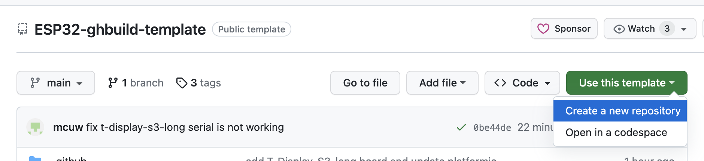

# ESP32 project template

## Modbus RTU Protocol V1

### Function Code Introduction
Function Code (hex) ------------- Description	-------------------------- Note
0x03	                            Read holding register	                 
0x06	                            Write single register	                 
0x10                              Write Multiple registers

### Register Address Introduction
Address (Decimal) -- Address storage content -------------------------- Permission ------------- Modbus Function Code
                     0x0000: relay off
32 ~ 37              0x0001: relay on                                   Read/Write               0x03, 0x06, 0x10
                     0x0002: relay toggle

48                   0x~~FF: digital led red color                      Read/Write               0x03, 0x06, 0x10
49                   0x~~FF: digital led green color                    Read/Write               0x03, 0x06, 0x10
50                   0x~~FF: digital led blue color                     Read/Write               0x03, 0x06, 0x10
51                   0x~~FF: digital led brightness                     Read/Write               0x03, 0x06, 0x10

56                   0x~~~7: buzzer tone                                Read/Write               0x03, 0x06, 0x10

128                 UART Parameter
                    The high 8 bits indicate the parity mode: 0x00~0x02 Read/Write               0x03, 0x06
                    The low 8 bits indicate the baudrate : 0x00~0x07    Read/Write

130                 Device Address
                    Directly store Modbus address                       Read/Write               0x03, 0x06
                    Device address: 0x0001-0x00FF

132                 Software Version                                    Read/Write               0x03
                    Converting to decimal and then shifting the decimal 
                    point two places to the left will represent the 
                    software version 0x0064 = 100 = V1.00

## Description

This is a project...

## Requirements

- [GitHub Actions](https://github.com/features/actions)
- [platformio](https://platformio.org/)
- [python](https://www.python.org/)

## GitHub Actions - Workflow

The release build happens in the `build & release` workflow: [build_release.yml](.github/workflows/build_release.yml).
It creates a release, after creation of a new git tag (named it like `v1.0.0`).

If you want to test the build on all merge w/o creating a tag then the `build` workflow is what you looking for: [build.yml](.github/workflows/build.yml)

## PlatformIO

[PlatformIO](https://platformio.org/) is a tool to create microcontroller apps for arduino platforms and compatibles (esp32). You can install the [Visual Studio Code extension](https://platformio.org/install/ide?install=vscode) in the [Visual Studio Code](https://code.visualstudio.com/) IDE.

## Python

There is a tiny python script needed to customize the firmware filenames within platformio, see documentation: https://docs.platformio.org/en/stable/scripting/examples/custom_program_name.html

The [extra_script.py](extra_script.py) script gets the platformio env (e.g. lolin32) and the git-tag for the firmware filename.
This is required to publish several firmware names in the github artifacts of a release.

## Get Started

1. Login to github

2. Click on `Use this template` to create a new git repository
3. Implement your application in the [src/main.cpp](src/main.cpp)
4. Comment your new change in the [CHANGELOG.md](CHANGELOG.md) file
5. Push your changes

6. You can find your firmwares under `Releases` after the CI build finished

## CHANGELOG

You can write your changes in the [CHANGELOG.md](CHANGELOG.md) before you create a release. It will be shown under the release page.

## Example Release

see [Releases](https://github.com/mcuw/esp-ghbuild-template/releases) on the right sidemenu.

## Customize your project

You can reduce and adapt your required boards in the [platformio.ini](platformio.ini).

Update the [CHANGELOG.md](CHANGELOG.md) file before you are creating a new release. By creating a new git tag you trigger a new release which generate for you the firmwares.

## Supported boards

Buy on AliExpress (affiliate links) ...

- ESP32 S3
  - [ESP32-S3-Relay-6CH](https://www.waveshare.com/wiki/ESP32-S3-Relay-6CH)

## Disclaimer

Contribution and help - if you find an issue or wants to contribute then please do not hesitate to create a pull request or an issue.

We provide our build template as is, and we make no promises or guarantees about this code.