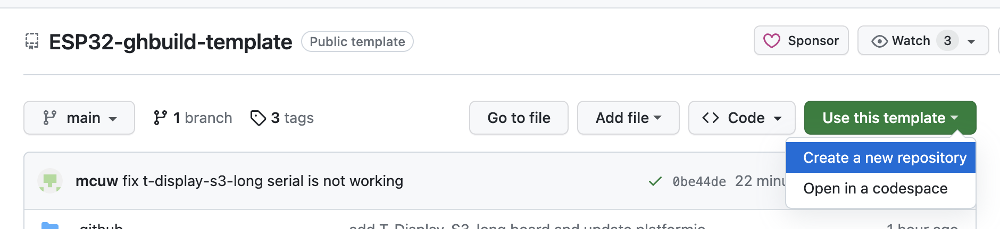

# Switch Actuator

Switch Actuator is production-oriented ESP32-S3 firmware for deterministic relay control through KNX/IP, Modbus RTU, local service tools, and an authenticated web interface.

## Product Documentation

The canonical product documentation is organized by architecture, protocols,
product lifecycle, manufacturing, and release responsibility in the
[Product Documentation Index](docs/README.md).

## Modbus RTU Protocol

The public, frozen product interface is [Modbus RTU](docs/protocols/modbus.md).
It defines zero-based register addresses, data types, access rights, defaults,
ranges, persistence, side effects, reset behavior, serial settings, supported
function codes, exceptions, and broadcast behavior.

## KNX/IP Application

The implemented KNX/IP product contract is [KNX/IP](docs/protocols/knx-ip.md).
It freezes parameters, communication-object numbers, group-address rules,
DPTs, startup/status behavior, central functions, scene reservations,
diagnostics, and the ETS/product-data delivery strategy.

## Compatibility Versions

The current compatibility set is `HW-A01`, `FW-1.4.0`, `CFG-4`, `API-v1`,
`MODBUS-v1`, `KNX-APP-v1`, and `FS-v1`. Firmware exposes the complete set
through the serial `version` command and authenticated web capabilities. See
[Version Compatibility Contract](docs/product/compatibility.md) for sources
of truth and independent bump rules.

## Requirements

- [GitHub Actions](https://github.com/features/actions)
- [platformio](https://platformio.org/)
- [python](https://www.python.org/)

## GitHub Actions - Workflow

The release build happens in the `build & release` workflow: [build_release.yml](.github/workflows/build_release.yml).
It creates a release, after creation of a new git tag (named it like `v1.0.0`).

If you want to test the build on all merge w/o creating a tag then the `build` workflow is what you looking for: [build.yml](.github/workflows/build.yml)

## PlatformIO

[PlatformIO](https://platformio.org/) is a tool to create microcontroller apps for arduino platforms and compatibles (esp32). You can install the [Visual Studio Code extension](https://platformio.org/install/ide?install=vscode) in the [Visual Studio Code](https://code.visualstudio.com/) IDE.

## Default Configuration

Data-driven deployment configuration lives in the seven JSON files under [data/config](data/config). PlatformIO packages that directory as LittleFS. [config/default_configuration.json](config/default_configuration.json) remains an embedded monolithic recovery fallback, so firmware can boot safely when LittleFS is blank or unavailable.

At boot, precedence is valid NVS, the complete `/config/*.json` bundle, the complete `/config/.backup/*.json` bundle, embedded JSON, then safe domain defaults. LittleFS mount failure does not trigger automatic formatting: firmware uses the embedded fallback, reports a filesystem fault, and remains degraded. NVS corruption or I/O failure likewise remains a degraded-state fault even when a JSON fallback succeeds. See [Filesystem architecture](docs/architecture/filesystem.md) for section ownership, recovery, and security rules.

The bundle defines device identity, network and Wi-Fi behavior, Modbus serial settings, all six relay policies, KNX bindings, web/security flags, and indicator limits. Every file is required, each section is limited to 8192 bytes, and the assembled configuration is accepted only after complete schema and domain validation. Ethernet must remain disabled for the current board. Replace the development serial number and UUID with deployment-specific provisioned values before production; do not place secrets in these files.

Build and upload the LittleFS configuration explicitly with `pio run -e development -t buildfs` and `pio run -e development -t uploadfs`. A normal firmware upload does not replace the filesystem image.

The firmware has explicit `development`, `engineering`, and `production` build profiles. Production is fail-closed, emits only a separately signed release artifact, and requires the audited secure-boot and flash-encryption manufacturing workflow described in [Security architecture](docs/architecture/security.md).

Tagged builds publish the complete firmware, bootloader, partitions, filesystem, manifest, detached signature, checksums, version metadata, SPDX SBOM, and release notes package defined in [Release process](docs/release/release-process.md).

## Python

There is a tiny python script needed to customize the firmware filenames within platformio, see documentation: https://docs.platformio.org/en/stable/scripting/examples/custom_program_name.html

The [extra_script.py](extra_script.py) script gets the platformio env (e.g. lolin32) and the git-tag for the firmware filename.
This is required to publish several firmware names in the github artifacts of a release.

## Get Started

1. Login to github

2. Click on `Use this template` to create a new git repository
3. Implement your application in the [src/main.cpp](src/main.cpp)
4. Comment your new change in the [CHANGELOG.md](CHANGELOG.md) file
5. Push your changes

6. You can find your firmwares under `Releases` after the CI build finished

## CHANGELOG

You can write your changes in the [CHANGELOG.md](CHANGELOG.md) before you create a release. It will be shown under the release page.

## Example Release

see [Releases](https://github.com/mcuw/esp-ghbuild-template/releases) on the right sidemenu.

## Customize your project

You can reduce and adapt your required boards in the [platformio.ini](platformio.ini).

Update the [CHANGELOG.md](CHANGELOG.md) file before you are creating a new release. By creating a new git tag you trigger a new release which generate for you the firmwares.

## Supported boards

Buy on AliExpress (affiliate links) ...

- ESP32 S3
  - [ESP32-S3-Relay-6CH](https://www.waveshare.com/wiki/ESP32-S3-Relay-6CH)

## Disclaimer

Contribution and help - if you find an issue or wants to contribute then please do not hesitate to create a pull request or an issue.

We provide our build template as is, and we make no promises or guarantees about this code.
