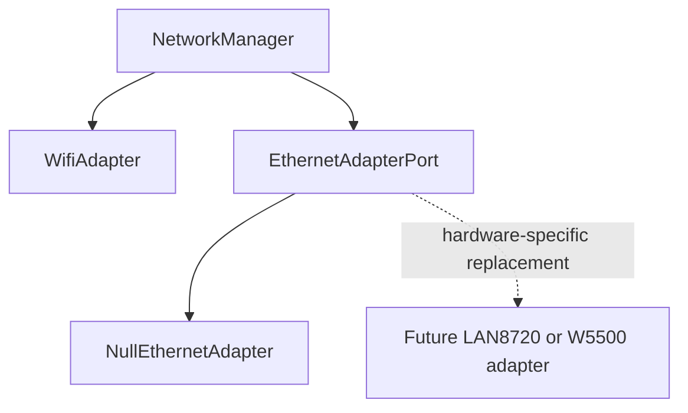

# Ethernet Adapter Preparation

## Decision

The Waveshare ESP32-S3 Relay 6CH has Wi-Fi but no onboard Ethernet PHY, Ethernet controller, magnetics, or RJ45 path. Firmware for this board must not initialize Ethernet, reserve speculative Ethernet GPIOs, advertise Ethernet capability, or pull an Ethernet driver into the build.

Ethernet remains an optional adapter behind `NetworkManager`:



The application and domain layers consume only `NetworkStatusPort` and `NetworkControlPort`. They do not include Arduino `WiFi.h`, `ETH.h`, Ethernet controller libraries, or PHY event types.

## Current Waveshare Composition

The composition root injects:

```text
NetworkManager
|-- WifiAdapter
`-- NullEthernetAdapter
```

The Waveshare board descriptor declares:

```text
wifi = true
ethernet = false
ethernetImplementation = None
```

Descriptor validation rejects both inconsistent states: claiming Ethernet with implementation `None`, and naming an implementation while claiming Ethernet is unavailable. Runtime Ethernet capability is true only when the selected board descriptor supports Ethernet and the injected adapter reports itself available. Therefore the Waveshare web API reports `features.ethernet=false` without a board-name special case.

The null adapter is inert: initialization fails closed, update and shutdown are no-ops, link and online state remain false, and all addresses remain zero.

## Adapter Contracts

`WifiAdapter` exclusively owns Arduino Wi-Fi station, scan, static/DHCP configuration, recovery AP, and IP-address calls. `NetworkManager` owns policy, profile order, retry timing, lifecycle transitions, provisioning orchestration, and the application-facing status snapshot.

`EthernetAdapterPort` defines only lifecycle and status operations:

- capability query through its snapshot;
- initialize with the validated hostname;
- bounded non-blocking update;
- idempotent shutdown;
- link, online, IPv4, gateway, and DNS status.

No LAN8720 or W5500 behavior is implemented for the current board. In particular, the manager does not initialize the Ethernet port until a future Ethernet configuration and selection policy are implemented and validated for an Ethernet-capable board.

## Future Hardware Variant

A future board may provide either:

```text
ESP32-S3 internal EMAC -> LAN8720 PHY -> magnetics/RJ45
ESP32-S3 SPI           -> W5500       -> magnetics/RJ45
```

That variant must add all of the following together:

1. A board descriptor with `ethernet=true`, the correct implementation enum, and schematic-verified pins.
2. A concrete adapter implementing `EthernetAdapterPort` with bounded, non-blocking lifecycle behavior.
3. Hardware-specific driver dependencies in that board's PlatformIO environment, not shared Waveshare dependencies.
4. Domain configuration for Ethernet enablement, DHCP/static IPv4, and transport preference.
5. `NetworkManager` selection, stability, and Wi-Fi fallback policy using the existing adapter port.
6. Host tests for selection/failover and hardware tests for link, DHCP/static addressing, reconnect, and relay isolation.

The application services, relay policy, diagnostics consumers, web command path, KNX/IP integration, and Modbus RTU path do not change. They continue to consume the same network status/control ports.

## Safety Constraints

- Ethernet pins must never overlap relay, RS-485, BOOT, RGB, or buzzer pins without schematic proof and descriptor validation.
- Network loss or transport switching must not alter relay outputs or block local/Modbus control.
- Link-up without a usable IP address is not online.
- Driver callbacks must not perform relay operations, persistence, or unbounded work.
- The recovery AP remains a Wi-Fi adapter responsibility and must not be bridged to Ethernet.