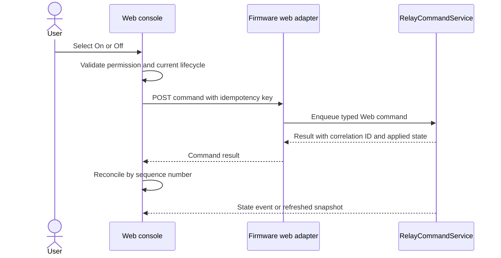

# Switch Actuator Frontend Web Instructions

## 1. Purpose and Status

This document is the normative product, UX, frontend architecture, and delivery specification for the Switch Actuator web console. The console controls and monitors relay channels exposed by the firmware through the web adapter while Modbus RTU and KNX remain active peers.

The keywords **MUST**, **MUST NOT**, **SHOULD**, **SHOULD NOT**, and **MAY** define requirements. This document complements `design/software-architecture-instructions.md`; the firmware architecture is authoritative for relay safety, command arbitration, persistence, protocol behavior, and hardware constraints.

The file name `fontend-instructions.md` is retained because it is the requested repository path. New references SHOULD use this exact path until a deliberate repository-wide rename is approved.

## 2. Product Intent

The web console is an operational tool for installers, commissioning engineers, and authorized operators. Its first screen MUST be the usable relay control surface, not a marketing page, setup wizard, or decorative dashboard.

The interface shall let a user answer these questions quickly:

1. Is this the intended physical device?
2. Is the device healthy and operational?
3. Which relay channels are on, off, locked, unavailable, or faulted?
4. Did the most recent command succeed, and what state was actually applied?
5. Are Modbus and KNX configured and communicating correctly?
6. Are there unapplied configuration changes or a required restart?

Safety and state certainty take priority over visual novelty. The UI MUST distinguish requested state, firmware-applied state, physical contact verification when available, and unknown state. It MUST never imply that a physical load is de-energized solely because a network request was sent.

## 3. Scope

The production console includes:

- authenticated sign-in and session handling;
- device identity and lifecycle visibility;
- relay overview and per-channel control;
- command acknowledgement and rejection details;
- channel naming, enablement, restore behavior, and optional policy configuration;
- Modbus RTU configuration and health;
- KNX availability, commissioning state, bindings, and health when supported;
- network and web security configuration when supported;
- diagnostics, event history, support export, restart, update, and factory reset;
- responsive layouts for desktop, tablet, and mobile;
- accessible keyboard, pointer, touch, and assistive-technology operation.

The frontend MUST NOT:

- access GPIO, Modbus memory, or KNX library objects directly;
- implement relay arbitration, interlocks, timers, or safety policy locally;
- claim success before the firmware returns an accepted result and applied state;
- fabricate telemetry while disconnected;
- use browser storage as authoritative configuration or relay state;
- expose secrets, private keys, session tokens, or sensitive commissioning data;
- require a cloud service for local device operation.

## 4. Users and Authorization

### 4.1 Roles

The API is authoritative for authorization. The frontend hides unavailable actions for clarity but MUST also handle `403 Forbidden` correctly.

| Role | Intended access |
|---|---|
| Viewer | Read device, relay, protocol, and diagnostic state |
| Operator | Viewer access plus relay commands and acknowledgement of non-critical notices |
| Installer | Operator access plus channel, Modbus, KNX, and network configuration |
| Administrator | Installer access plus users, firmware update, restart, support export, and factory reset |

A firmware build MAY expose fewer roles, but MUST return explicit capabilities and permissions. The UI MUST derive available actions from those permissions instead of hard-coding role names.

### 4.2 Session Behavior

- Authentication MUST use a secure server-managed session or another approved device-local scheme.
- Session cookies MUST be `HttpOnly`, `Secure` when HTTPS is active, and `SameSite=Strict` unless a reviewed integration requires otherwise.
- The frontend MUST NOT store authentication tokens in `localStorage` or URL parameters.
- Mutating requests MUST include CSRF protection when cookie authentication is used.
- The UI MUST provide sign-out and show the signed-in identity and effective permission level.
- Session expiry MUST preserve only non-sensitive unsaved form input in memory and route to sign-in with a clear reason.
- Failed authentication MUST use a generic message and MUST NOT reveal whether a username exists.

## 5. Information Architecture

Use a persistent application shell with a compact device identity header, primary navigation, connection state, and account menu. Desktop uses a restrained left navigation rail; narrow screens use a bottom navigation bar for primary operational destinations and an overflow menu for administration.

Primary destinations:

| Route | Label | Purpose |
|---|---|---|
| `/` | Relays | Live channel state and authorized control |
| `/protocols` | Protocols | Modbus and KNX status/configuration |
| `/diagnostics` | Diagnostics | Health, faults, events, counters, and support export |
| `/settings` | Settings | Device, channel, network, security, and restore policy |
| `/maintenance` | Maintenance | Firmware update, restart, backup/restore, factory reset |
| `/login` | Sign in | Authentication only |

The selected route MUST survive a normal reload. Protected routes MUST redirect unauthenticated users to `/login` and return them to the original safe route after successful authentication. Never return automatically to a destructive confirmation flow.

The header MUST show:

- configured device name as the strongest first-viewport identity;
- model and short serial/UUID discriminator;
- lifecycle state;
- live connection state;
- an unresolved critical-fault indicator when applicable.

## 6. Visual Direction

The visual language is an industrial control panel: precise, calm, high-contrast, and optimized for repeated scanning. It MUST NOT look like a consumer smart-home app or a marketing landing page.

### 6.1 Design Tokens

Use CSS custom properties and semantic tokens. The initial light palette is:

```css
:root {
	--color-canvas: #f3f5f4;
	--color-surface: #ffffff;
	--color-surface-subtle: #e8ecea;
	--color-text: #18201d;
	--color-text-muted: #56635d;
	--color-border: #c8d0cc;
	--color-accent: #006b5b;
	--color-accent-hover: #005548;
	--color-on: #087f5b;
	--color-off: #66716c;
	--color-warning: #a35b00;
	--color-danger: #b42318;
	--color-info: #1769aa;
	--color-focus: #005fcc;
	--shadow-overlay: 0 12px 32px rgb(24 32 29 / 18%);
	--radius-control: 4px;
	--radius-panel: 6px;
	--space-1: 4px;
	--space-2: 8px;
	--space-3: 12px;
	--space-4: 16px;
	--space-6: 24px;
	--space-8: 32px;
}
```

Status MUST never be communicated by color alone. Every state uses text plus an icon or shape. Green means confirmed normal/on, gray means confirmed off/neutral, amber means degraded or pending, red means fault/danger, and blue means informational/action focus. Do not use gradients, decorative blobs, glass effects, or a one-hue palette.

Dark mode MAY be added only after the light operational theme passes contrast and hardware display testing. It MUST follow system preference and offer an explicit user override; it is not the default design target.

### 6.2 Typography and Iconography

- Use a locally bundled, compact humanist sans-serif with clear numerals, such as `IBM Plex Sans`, with a licensed subset suitable for embedded delivery.
- Use a locally bundled monospace face such as `IBM Plex Mono` only for addresses, IDs, register values, versions, and logs.
- Do not load fonts, icons, analytics, or scripts from a CDN.
- Body text defaults to 15-16 px with at least 1.45 line height.
- Do not scale font size with viewport width and do not use negative letter spacing.
- Use sentence case for headings, labels, buttons, and messages.
- Use Lucide icons through a tree-shaken/local package or compile selected icons into the application. Icons are decorative when adjacent text already names the action.
- Icon-only buttons are reserved for familiar compact actions such as refresh, close, reveal, download, and overflow; each requires an accessible name and tooltip.

### 6.3 Density and Structure

Page sections are unframed layouts separated by spacing, dividers, or full-width bands. Cards are used only for repeated relay channels, discrete fault/event items, and modal dialogs. Do not nest cards.

The content container SHOULD be 1200-1440 px wide on desktop. Use a stable grid and avoid oversized titles. The relay grid uses:

- six columns only when each channel remains at least 176 px wide;
- three columns on common desktop/tablet widths;
- two columns on wide mobile where labels fit;
- one column below approximately 420 px or when localization requires it.

Breakpoints are outcomes, not device assumptions. Use CSS grid with `minmax()` and container queries where supported.

## 7. Application Shell and Global States

### 7.1 Connection Indicator

Connection status is always visible and has four states:

| State | UI treatment | Control behavior |
|---|---|---|
| Live | Small confirmed label with last update age | Commands enabled by permissions/state |
| Reconnecting | Amber label and retry progress | No new commands; pending command remains visible |
| Offline | Persistent top banner with last successful contact | All mutating controls disabled |
| Incompatible | Red banner naming required UI/API version | All mutating controls disabled |

Do not use toast notifications for persistent connection loss. A stale snapshot remains visible with a clear `Last updated` timestamp and an `Offline data` label; it MUST NOT look live.

### 7.2 Lifecycle Handling

| Firmware lifecycle | Frontend behavior |
|---|---|
| Booting | Read-only skeleton/status view; reconnect with bounded backoff |
| Configuring | Show configuration state; relay commands disabled |
| Operational | Normal capability-based controls |
| Degraded | Keep safe available actions; persistent reason banner |
| Fault | Disable affected actions, foreground fault and safe recovery path |
| Restarting | Show restart progress, stop sending requests, resume after identity verification |

Skeletons are for first-load structure only. They MUST NOT replace known stale values during reconnect.

### 7.3 Notifications

- Inline validation appears next to the relevant field.
- Command results appear adjacent to the affected relay and in an accessible status region.
- Toasts are reserved for brief non-critical global confirmations and disappear no sooner than 6 seconds; they are pausable and recorded in recent activity when operationally relevant.
- Warnings and errors requiring action remain until resolved or explicitly dismissed.
- Error messages state what failed, whether device state may have changed, and the next safe action.

## 8. Relay Control Surface

### 8.1 Overview Header

The relay page begins with a compact summary containing:

- count on, off, faulted, locked, and unavailable;
- `Last updated` age;
- filter for all/on/off/attention;
- sort by physical channel or configured name;
- authorized `All off` command;
- no `All on` command by default.

`All off` is visually distinct but not styled as destructive data deletion. It opens a confirmation that names the number of affected active channels. If there are no active channels, it behaves as an idempotent command without a modal.

### 8.2 Relay Channel Item

Each channel item has a fixed internal layout so state changes do not move neighboring content. It displays:

- physical channel label, for example `CH1`;
- configured human name, with channel label retained even when named;
- large explicit applied state: `On`, `Off`, `Unknown`, `Locked`, or `Fault`;
- state icon/indicator that does not rely on color;
- command source and age of the last accepted transition;
- policy badges only when exceptional, such as interlock, timer, manual lockout, or restore override;
- a two-position `Off | On` segmented control for normal commands;
- an overflow menu for optional toggle, details, and authorized channel settings.

The segmented control MUST expose the applied state rather than just the last clicked choice. It is disabled while the same channel command is pending. `Toggle` is a command, not a persistent third state, and MUST never appear as a latched position.

The item MUST distinguish:

- **pending**: command accepted by the browser but not yet resolved by firmware;
- **accepted/applied**: firmware response contains final applied state and correlation ID;
- **idempotent**: requested state already applied;
- **rejected**: no assumed state change; show reason;
- **timed out/unknown outcome**: refresh authoritative state before allowing another command.

Never apply optimistic relay state. A subtle progress indicator may appear immediately, but the displayed `On`/`Off` value changes only from a command result or newer device event/snapshot.

### 8.3 Command Flow



Command rules:

- Generate a cryptographically random idempotency key for each deliberate command.
- Disable duplicate submission while pending.
- Do not automatically retry a timed-out mutating request unless the API guarantees idempotency by key.
- After an ambiguous timeout, fetch the channel snapshot and reconcile by transition sequence.
- Ignore events older than the current per-channel sequence.
- Show the firmware rejection reason, such as safety lockout, interlock, queue full, lifecycle unavailable, or authorization failure.
- Client-side debounce improves usability but MUST NOT be treated as a safety control.

### 8.4 Channel Details

Use a side panel on desktop and a full-screen sheet on mobile. Show requested state, applied state, verification capability, last source, transition sequence/time, fault details, restore policy, and active constraints. Technical values are selectable text, not editable unless the user enters the settings flow.

## 9. Protocols Workspace

Use tabs for `Overview`, `Modbus RTU`, and `KNX`. Hide unsupported tabs only when capabilities explicitly say the protocol is absent; otherwise show `Unavailable` with the hardware/firmware reason.

### 9.1 Overview

Display protocol health in a compact comparison table:

- enabled/available state;
- current transport and address;
- last valid message age;
- valid message and error counters;
- degraded/fault reason;
- whether a restart is pending.

Relay states shown here are read-only links back to the relay workspace. Do not provide separate protocol-specific relay controls because all sources share one authoritative state.

### 9.2 Modbus RTU

Configuration fields include unit ID, baud rate, parity, data bits, and stop bits. Use constrained controls:

- numeric input/stepper for unit ID `1..247`;
- select menu for supported baud rates;
- segmented control or select for parity;
- select for supported framing options.

Show GPIO17 TX/GPIO18 RX and UART1 as read-only board facts, not editable settings. Never offer an RS-485 DE/RE pin unless the board capability declares one.

The page also shows active settings, staged settings, request/error/timeout counters, last valid request, and a link to a read-only register-map reference. Addresses MUST be labeled as zero-based PDU addresses; if `4xxxx` notation is shown, label it separately.

Transport changes use `Edit -> Validate -> Review -> Apply`. The review states that Modbus communication may be interrupted and whether a restart is required. The UI MUST wait for persistence success before claiming completion.

### 9.3 KNX

When supported, display physical medium, individual address, bus state, programming mode, last telegram age, telegram/error counters, and secure-mode capability. Group bindings use an editable table with:

- channel;
- object role (`Switch command`, `Switch status`, `Fault`, or a firmware-declared optional object);
- datapoint type;
- group address;
- enabled state;
- validation status.

Group addresses use structured three-level inputs when that notation is configured. The frontend MUST submit the firmware's canonical representation and MUST NOT infer unsupported datapoint types.

Programming mode requires Installer permission and explicit confirmation. Show a persistent banner and countdown while active. Never display KNX keys. If KNX hardware is absent, explain `Not available on this hardware` and do not render fake configuration controls.

## 10. Settings

Settings use a two-pane layout on desktop and a section list on mobile. Sections are `Device`, `Channels`, `Restore and safety`, `Network`, `Web access`, and `Time` when supported by capabilities.

### 10.1 Form Rules

- Forms start in read mode; an explicit `Edit` action enters edit mode.
- Dirty forms show a visible `Unsaved changes` state and protect against accidental navigation.
- `Cancel` restores the latest server snapshot.
- `Save` remains disabled until values differ and all local validation passes.
- Server validation is authoritative and maps field errors to controls.
- Never silently normalize a safety-relevant value; show the normalized preview before apply.
- Configuration returned with a newer generation than the edit base causes a conflict view; never overwrite it silently.
- Settings requiring restart are grouped and applied in one controlled restart prompt.

### 10.2 Channel Configuration

For each firmware-declared channel support:

- name with length and character constraints from capabilities;
- enabled toggle;
- restore policy select: `All off`, `Last known`, or `Configured default` as supported;
- configured default state when applicable;
- interlock/timing policies only if firmware capabilities expose them;
- read-only physical channel and GPIO metadata for installers.

Safety-impacting changes include a concise consequence summary. Do not place all channels inside nested cards; use a dense table on desktop and one repeated channel item per mobile row.

### 10.3 Restore and Safety

Default `All off` is visibly marked as the safest policy. Selecting `Last known` after abnormal reset requires acknowledgement of its operational consequence. The frontend MUST not invent restore choices omitted by firmware capabilities.

## 11. Diagnostics

The diagnostics workspace is read-only except for explicit actions such as clear counters or export support bundle. It contains:

- device identity, firmware/build, board, uptime, reset reason, and lifecycle;
- relay snapshot with source, transition count, and per-channel fault;
- Modbus and KNX health/counters;
- storage generation and persistence fault;
- heap low-water mark and watchdog state when available;
- chronological event table with severity, module, code, summary, and device monotonic/wall time;
- bounded filtering by severity/module/search text.

Prefer tables and definition lists to decorative metric cards. Raw log streaming is disabled by default, bounded, rate-limited, pausable, and never the only representation of faults.

Support export MUST preview included categories and explicitly state that secrets are excluded. The generated file name includes sanitized model, serial suffix, and UTC timestamp. The frontend MUST treat exported diagnostic text as untrusted data and never render it as HTML.

## 12. Maintenance

### 12.1 Firmware Update

The update flow supports a local signed image unless another approved transport is declared. It shall:

1. Select one file using a standard file control/drop target.
2. Validate extension and client-side size limit without claiming cryptographic validity.
3. Ask the firmware to validate signature, product, hardware compatibility, version, and rollback policy.
4. Present validated metadata and release consequence.
5. Require Administrator confirmation.
6. Upload with progress based on bytes acknowledged.
7. Show verification, installation, restart, reconnect, and health-confirmation phases.
8. Verify device identity and reported version after reconnect.

Navigation and relay controls are disabled only during firmware-declared unsafe update phases. Closing the browser MUST NOT corrupt an update already committed by firmware. Never claim success until the new image reports healthy; show rollback status when applicable.

### 12.2 Restart

Restart requires confirmation and states that relay startup behavior follows configured restore policy. After request acceptance, transition to the restarting screen, reconnect with capped exponential backoff and jitter, verify identity, then return to diagnostics or the originating safe route.

### 12.3 Factory Reset

Factory reset is the most visually severe action. It requires Administrator permission, re-authentication when supported, and typed confirmation using the device name or serial suffix. The dialog lists erased categories and states that relays restart off. Never combine factory reset with restart in one ambiguous control.

## 13. API Contract

The frontend consumes a versioned, same-origin JSON API under `/api/v1`. The exact implementation MAY evolve, but equivalent contracts are mandatory.

### 13.1 Common Rules

- Requests and responses use UTF-8 JSON except firmware upload and support download.
- Every response includes `X-Request-Id`; mutating responses include a correlation ID.
- State snapshots include `apiVersion`, `deviceId`, `bootId`, and monotonic `snapshotSequence`.
- Timestamps use RFC 3339 UTC when wall time is valid; monotonic age/sequence remains available when it is not.
- State-changing requests use `Content-Type: application/json`, CSRF protection, payload limits, and idempotency keys.
- Unknown response fields are ignored for forward compatibility; missing required fields fail safely.
- Values exceeding JavaScript's safe integer range are encoded as decimal strings.
- The API returns `Cache-Control: no-store` for authentication, state, configuration, and diagnostics.

Minimum endpoints:

| Method and path | Purpose |
|---|---|
| `POST /api/v1/session` | Sign in |
| `DELETE /api/v1/session` | Sign out |
| `GET /api/v1/capabilities` | Hardware, features, limits, API compatibility, permissions |
| `GET /api/v1/device` | Identity, lifecycle, firmware, connection facts |
| `GET /api/v1/relays` | Authoritative channel snapshot |
| `POST /api/v1/relays/{id}/commands` | Submit set/toggle command |
| `POST /api/v1/relays/commands` | Validated multi-channel command, including all-off |
| `GET /api/v1/configuration` | Current configuration plus generation/ETag |
| `PUT /api/v1/configuration` | Validate and persist configuration using `If-Match` |
| `GET /api/v1/protocols` | Modbus and KNX status/counters |
| `GET /api/v1/diagnostics` | Bounded diagnostic snapshot |
| `GET /api/v1/events` | Server-Sent Events stream |
| `POST /api/v1/firmware/validate` | Validate update metadata/signature |
| `POST /api/v1/firmware` | Upload approved firmware image |
| `POST /api/v1/actions/restart` | Controlled restart |
| `POST /api/v1/actions/factory-reset` | Factory reset |

### 13.2 Capability Discovery

The app MUST fetch capabilities before rendering protected operational controls. Capabilities include at least:

```json
{
	"apiVersion": "1.0",
	"minimumUiVersion": "1.0.0",
	"model": "Waveshare ESP32-S3-Relay-6CH",
	"channelCount": 6,
	"features": {
		"modbus": true,
		"knx": false,
		"webUpdate": true,
		"contactFeedback": false
	},
	"limits": {
		"channelNameBytes": 32,
		"eventPageSize": 100,
		"firmwareUploadBytes": 2097152
	},
	"permissions": ["relay:read", "relay:command", "diagnostics:read"]
}
```

This example is illustrative, not a hard-coded fallback. An absent/invalid capability response puts the UI in incompatible read-only state. The UI MUST create channel controls from `channelCount` and channel descriptors returned by the device.

### 13.3 Relay Command

Example request:

```http
POST /api/v1/relays/0/commands
Idempotency-Key: 4dcbd6f3-735d-4cf5-911b-c8b55cf08f13
Content-Type: application/json

{"action":"setOn","expectedSequence":41}
```

Example applied response:

```json
{
	"correlationId": "web-7281",
	"result": "applied",
	"channel": 0,
	"appliedState": "on",
	"sequence": 42,
	"source": "web"
}
```

Use `409 Conflict` for stale expected sequence/configuration generation, `422 Unprocessable Content` for domain validation, `423 Locked` for safety lockout, `429 Too Many Requests` for rate/queue limits, and `503 Service Unavailable` for non-operational lifecycle. Error bodies use stable codes and safe human summaries:

```json
{
	"error": {
		"code": "relay.safety_lockout",
		"message": "Channel 1 is locked off by a safety policy.",
		"requestId": "req-9124",
		"details": {"channel": 0}
	}
}
```

Never render server messages as HTML. Branch behavior on stable `code`, not localized `message`.

### 13.4 Live Updates

Use same-origin Server-Sent Events by default because state flow is primarily device-to-browser and SSE is simpler to operate on constrained firmware. WebSocket MAY replace it only with measured resource justification.

Event types include `device`, `relay`, `protocol`, `fault`, `configuration`, and `update`. Every event includes `bootId` and sequence. On gap, parse failure, boot ID change, or reconnect, discard assumptions and refetch snapshots. Keepalive comments SHOULD occur every 15-30 seconds through proxies.

Reconnection uses exponential backoff with jitter, for example 1, 2, 4, 8, 15, then 30 seconds maximum. Browser offline events may pause attempts. A successful event connection does not replace initial snapshot fetching.

## 14. Frontend Architecture

### 14.1 Technology

Recommended stack:

- TypeScript with `strict` mode;
- React and Vite for the build;
- React Router for route ownership;
- TanStack Query for server state, retries, invalidation, and mutations;
- React Hook Form plus Zod for forms and runtime boundary validation;
- CSS Modules or a small token-based stylesheet;
- Vitest and Testing Library;
- Playwright for browser and visual workflow tests;
- Mock Service Worker for API contract scenarios.

Dependencies MUST be pinned through the lockfile, license-reviewed, vulnerability-scanned, and justified against embedded bundle cost. Do not add a large component suite or global state library unless measured complexity requires it.

If firmware flash/RAM budgets cannot support this stack, ship precompressed static output or select a smaller framework in an ADR while preserving all contracts, accessibility, and test requirements.

### 14.2 Module Layout

```text
web/
	src/
		app/
			App.tsx
			router.tsx
			queryClient.ts
			session.ts
		api/
			client.ts
			schemas.ts
			errors.ts
			events.ts
		components/
			controls/
			feedback/
			layout/
		features/
			relays/
			protocols/
			diagnostics/
			settings/
			maintenance/
			auth/
		styles/
			tokens.css
			global.css
		test/
			fixtures/
			server/
	public/
	package.json
	vite.config.ts
```

Feature modules own route composition, queries, mutations, domain-specific display logic, and tests. Shared components MUST remain domain-neutral. API DTOs stay in `api/`; view models may derive display values but MUST preserve sequence, certainty, and lifecycle semantics.

### 14.3 State Ownership

- Firmware owns relay, lifecycle, protocol, configuration, and diagnostic state.
- TanStack Query cache owns fetched server snapshots in the browser.
- Form libraries own draft input until save/cancel.
- URL query parameters own shareable filters and selected tabs.
- Component state owns temporary disclosure, focus, and modal state.
- Browser storage MAY retain non-sensitive display preferences only, such as density or theme.
- Do not mirror server data into a global client store.

Use generated or runtime-validated API types. A schema mismatch becomes an incompatibility state with request ID and support action, not a best-effort relay control surface.

### 14.4 Error Boundaries

Place route-level error boundaries around operational areas. A failed diagnostics chart/table MUST NOT take down relay controls. The root boundary offers reload and safe sign-out but does not show raw stack traces in production.

## 15. Embedded Delivery and Performance

The production build is served same-origin by the device as immutable, content-hashed assets plus a non-cacheable HTML shell. Prefer Brotli when supported and retain gzip fallback.

Initial budgets, measured compressed over the wire:

| Resource | Budget |
|---|---:|
| HTML shell | 12 KiB |
| Initial route JavaScript | 120 KiB gzip |
| Initial route CSS | 24 KiB gzip |
| Locally subset fonts | 50 KiB total |
| Total first load | 220 KiB gzip |

The relay route and shell load eagerly. Protocols, diagnostics, settings, maintenance, update code, and nonessential icon sets load by route. Avoid animation libraries, chart libraries for simple counters, date libraries where `Intl` suffices, and broad utility imports.

Performance requirements on the minimum supported phone and desktop browser:

- cached relay console interactive within 1 second on local Wi-Fi under normal device load;
- uncached first load usable within 2.5 seconds on local Wi-Fi;
- visible command pending indication within 100 ms of activation;
- no cumulative layout shift from state updates;
- relay event reconciliation within 250 ms of receipt;
- lists remain responsive at firmware-declared event limits.

The UI MUST remain usable when fonts fail by defining a stable fallback stack. Service workers are prohibited by default because stale control UIs are hazardous. If offline installation is later required, it needs an ADR with strict UI/API compatibility and update invalidation behavior.

## 16. Responsive and Interaction Requirements

- Support viewport widths from 320 px through wide desktop without horizontal page scrolling.
- Data tables may use an explicitly labeled horizontal scroll region or transform into definition rows on mobile.
- Touch targets are at least 44 by 44 CSS px; adjacent destructive and state-changing controls need adequate separation.
- Stable control dimensions prevent pending indicators or long labels from moving layout.
- Truncate only secondary identifiers; reveal full value on focus/hover and make it copyable.
- Device names, translated strings, IPv6 addresses, UUIDs, and fault text MUST wrap without overlapping controls.
- Dialogs fit within the visual viewport, trap focus, restore focus on close, and keep primary/secondary actions visible without covering content.
- Do not use hover as the only way to reveal required information or actions.
- Respect `prefers-reduced-motion`; functional progress remains understandable without animation.

Motion is limited to short state transitions and a single restrained initial content reveal. Relay state changes do not use celebratory motion. Pending indicators animate without shifting content.

## 17. Accessibility and Localization

Target WCAG 2.2 AA.

- All functionality MUST be keyboard operable with visible focus.
- Use native controls whenever possible; custom segmented controls follow the relevant ARIA pattern and arrow-key behavior.
- Relay status changes use a polite live region; critical faults use an assertive alert without repeatedly announcing unchanged state.
- Pending state uses `aria-busy`; disabled controls include a discoverable reason nearby.
- Every input has a persistent visible label, description where needed, and programmatically associated error.
- Contrast is at least 4.5:1 for normal text, 3:1 for large text and graphical/control boundaries.
- Do not use tables for layout; operational data tables include proper headers and captions.
- Page title and main heading identify device and route.
- Skip link, landmarks, logical heading order, and focus management are mandatory.
- Automated accessibility checks are necessary but do not replace keyboard and screen-reader testing.

All display strings live in a message catalog even if the first release ships only English. Use `Intl` for dates and numbers. Protocol tokens, channel IDs, addresses, error codes, and enum values are not translated; explanatory labels are. Layout testing MUST include text expansion of at least 30 percent.

## 18. Security Requirements

- Serve only same-origin assets; no runtime CDN, analytics, trackers, remote fonts, or third-party embeds.
- Use a restrictive Content Security Policy, preferably nonce-free with external hashed assets: `default-src 'self'; script-src 'self'; style-src 'self'; img-src 'self' data:; connect-src 'self'; object-src 'none'; base-uri 'none'; frame-ancestors 'none'; form-action 'self'`.
- Set `X-Content-Type-Options: nosniff`, `Referrer-Policy: no-referrer`, and appropriate `Permissions-Policy` headers.
- Do not use `dangerouslySetInnerHTML` for API, log, file, Markdown, or user-controlled content.
- Validate all API responses and reject unexpected critical enum values safely.
- Encode route/path components and never construct API URLs from untrusted absolute URLs.
- Redact passwords, keys, tokens, cookies, and update payloads from error reports and logs.
- Never prefill saved passwords or secrets returned by the device; use blank replacement fields.
- Rate-limit sign-in and sensitive actions server-side; frontend cooldown is only feedback.
- Protect against clickjacking and prohibit embedding the console in frames.
- HTTPS is REQUIRED on untrusted networks. If constrained deployments permit HTTP on an isolated commissioning network, the UI MUST show a persistent `Connection not secure` warning and the threat model must document it.
- Dependency updates require lockfile review, tests, license review, and software bill of materials generation.

## 19. Testing and Quality Gates

### 19.1 Unit and Component Tests

Cover at least:

- relay state rendering for on/off/unknown/pending/locked/fault;
- no optimistic state transition;
- sequence reconciliation, stale event rejection, boot ID changes, and event gaps;
- command accepted, idempotent, rejected, timed out, queue full, forbidden, and session-expired flows;
- capability-driven channels and protocol availability;
- configuration dirty, validation, conflict, persistence, and restart-required flows;
- update validation, progress, restart, rollback, and identity mismatch;
- error redaction and untrusted diagnostic text rendering;
- keyboard behavior and accessible names for every custom control.

### 19.2 End-to-End Scenarios

Playwright tests run at desktop (1440 by 900), tablet (768 by 1024), and mobile (360 by 800). Required scenarios include:

1. Sign in, identify device, command one relay, and observe confirmed applied state.
2. Receive a Modbus-originated state event and reconcile the same relay without local command.
3. Receive a KNX-originated event or show hardware unavailable based on capabilities.
4. Lose connection during a command and recover without duplicate actuation.
5. Enter safety lockout and verify every on/toggle entry point is disabled or rejected clearly.
6. Edit Modbus settings, review restart impact, persist, restart, and reconnect.
7. Resolve a configuration generation conflict without overwriting newer data.
8. Navigate and operate the full relay page using keyboard only.
9. Complete firmware validation/update and verify new version or rollback.
10. Attempt factory reset with insufficient permission and with authorized typed confirmation.

### 19.3 Visual and Accessibility Tests

- Capture reviewed screenshots for all relay states, lifecycle states, protocol availability, forms, dialogs, and mobile layouts.
- Check screenshots for overlap, clipping, unintended horizontal scroll, blank regions, and layout shift.
- Run axe or equivalent on every route and major dialog.
- Manually test keyboard-only operation, 200 percent zoom, reduced motion, high contrast, screen-reader announcements, and 30 percent text expansion.
- Verify color-blind-safe state recognition without relying on hue.

### 19.4 Build Gates

Every frontend change MUST pass:

- formatting and linting with no ignored new errors;
- TypeScript strict typecheck;
- unit/component tests with meaningful coverage;
- production build and compressed bundle-size budget;
- end-to-end smoke tests against a contract-accurate firmware mock;
- accessibility checks;
- dependency audit, license check, and SBOM generation;
- firmware static-asset packaging and same-origin smoke test.

Critical relay command and reconciliation modules require 100 percent branch coverage. Overall frontend statement coverage SHOULD be at least 85 percent, with quality assessed by scenario coverage rather than percentage alone.

## 20. Firmware Integration Contract

Frontend and firmware builds MUST declare compatible API/UI versions. The firmware static asset manifest records UI version, content hashes, compression, and minimum API version. CI MUST fail when generated API schemas or fixtures drift from the firmware contract.

The firmware remains fully operational over Modbus/KNX when web assets fail to load. Serving the UI or event stream MUST NOT starve relay command processing, Modbus polling, KNX processing, watchdog service, or persistence. The firmware SHOULD enforce per-client connection and request limits and MAY shed diagnostics/event clients before operational protocols.

During development, the frontend uses a contract-accurate mock server containing:

- six-channel Waveshare capabilities;
- alternate channel counts to detect hard coding;
- every lifecycle and relay state;
- delayed, rejected, duplicated, reordered, and missing events;
- session expiry and permission variants;
- Modbus-only, KNX-enabled, and neither-available builds;
- configuration conflict, restart, update success, and rollback.

## 21. Delivery Phases

1. **Contract and shell.** Define versioned OpenAPI/JSON schemas, capability discovery, authentication, application shell, tokens, responsive navigation, and mock scenarios.
2. **Relay operations.** Implement authoritative snapshots, SSE reconciliation, command idempotency, relay grid, channel detail, offline handling, and safety states.
3. **Configuration and protocols.** Add validated settings, generation conflicts, Modbus workspace, KNX capability/bindings, and controlled restart.
4. **Diagnostics and maintenance.** Add event diagnostics, support export, firmware update, rollback visibility, restart, and factory reset.
5. **Production hardening.** Complete accessibility, localization readiness, CSP/security review, embedded bundle budgets, firmware packaging, soak tests, and hardware/browser verification.

Each phase MUST be independently releasable behind firmware capabilities. Do not expose placeholder controls for unsupported or unfinished operations.

## 22. Definition of Done

The frontend is production-ready only when:

- the first authenticated screen is a usable, capability-driven relay console;
- the current Waveshare board displays six channels without hard-coded six-channel assumptions;
- requested, applied, verified, pending, stale, unknown, locked, and fault states cannot be confused;
- no mutating action claims success before authoritative firmware acknowledgement;
- reconnect and timeout behavior cannot duplicate a relay command;
- Modbus and KNX changes appear as the same authoritative relay state;
- unsupported KNX hardware is represented honestly without fake controls;
- configuration uses validation, generation conflict protection, persistence acknowledgement, and explicit restart impact;
- authentication, CSRF, CSP, redaction, payload limits, and authorization behavior pass security review;
- every route works at 320 px width, 200 percent zoom, keyboard-only operation, and WCAG 2.2 AA checks;
- production assets meet measured flash, transfer, memory, and load budgets;
- all unit, contract, end-to-end, visual, accessibility, security, and firmware-packaging gates pass;
- firmware remains safe and field-bus responsive when the web client is disconnected, stale, malformed, or under load.

## 23. Required Decisions Before Implementation

Record ADRs or approved product decisions for:

1. Whether the production hardware has a network interface and whether web delivery is always enabled or a build feature.
2. HTTPS provisioning, certificate trust, hostname discovery, and isolated-HTTP commissioning policy.
3. Authentication, initial credential provisioning, roles/permissions, session timeout, and recovery.
4. Final API schema, SSE resource limits, idempotency retention, and UI/API compatibility window.
5. Frontend framework, embedded asset storage, compression, flash/RAM budgets, and license policy.
6. Supported browsers and minimum mobile/desktop hardware.
7. Firmware update transport, maximum image size, signing, rollback, and browser-interruption behavior.
8. Localization languages and whether device-local wall time is available.
