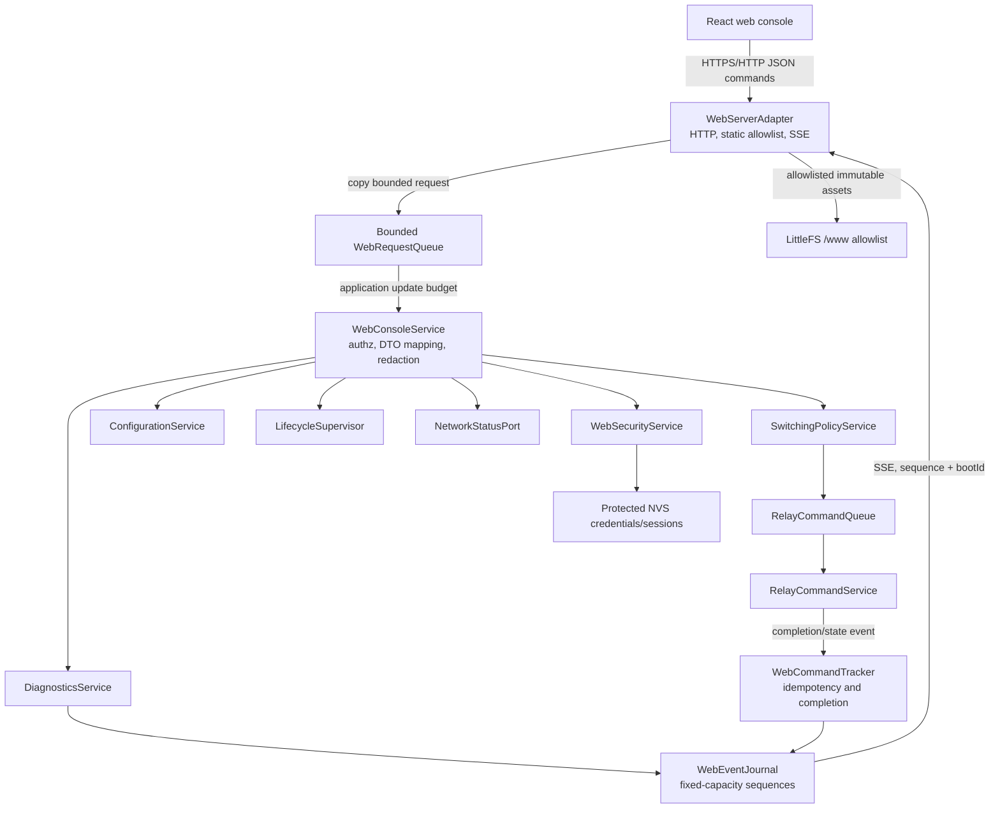
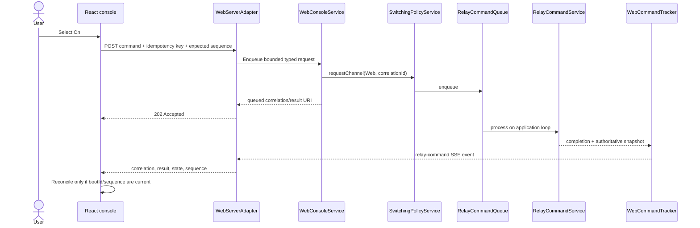
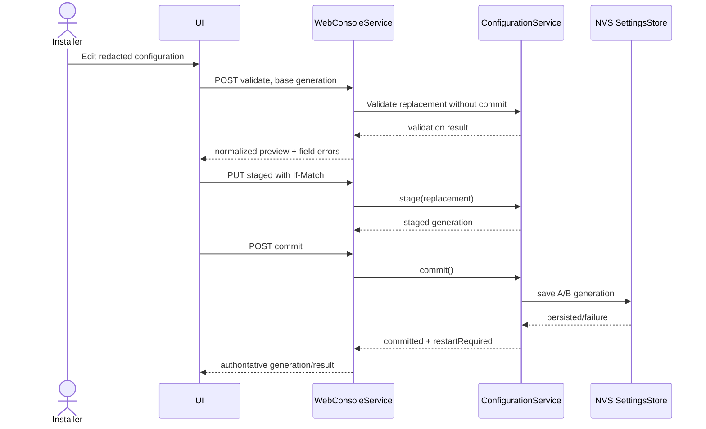

# Switch Actuator Frontend Implementation Plan

## 1. Current-State Assessment

### 1.1 Repository baseline

The repository already has the correct ports-and-adapters direction for a web console, but it does not yet contain an HTTP server or frontend application. The web work must extend the existing application boundary rather than create a second control path.

Confirmed reusable components are:

| Area | Existing implementation | Reuse in the web console |
|---|---|---|
| Composition and scheduling | `src/app/application.h`, `src/app/application.cpp` | Construct and schedule the web adapter after relay safety, configuration, and networking are initialized. Add bounded web work to `Application::update()` without delaying relay, Modbus, KNX, button, indicator, or watchdog work. |
| Relay state | `src/app/relay_command_service.h`, `src/domain/relay_types.h` | `RelayCommandService::snapshots()` is the authoritative source for requested state, applied state, source, transition sequence, timestamp, fault, and lockout. There is no physical contact feedback on this board. |
| Relay admission | `src/app/switching_policy_service.h` | All web commands use `SwitchingPolicyService` with `CommandSource::Web`. The web adapter must not call GPIO or `RelayCommandService::execute*()` directly. |
| Command queue | `src/app/relay_command_queue.h` | Fixed capacity is 16 batches, with two entries reserved for safety-off work. Queue-full must become an explicit API result. |
| Arbitration | `src/app/command_arbiter.*` | Web, KNX, Modbus, CLI, button, restore, scenes, and timers converge on the same arbitration rules. |
| Timers | `src/app/relay_timer_service.h` | Wrap-safe, fixed-capacity delayed commands exist, but there is no configured timer model, listing API, persistence, or application facade for web use. Do not advertise timed switching until those are added. |
| Scenes | `src/app/scene_service.h` | A fixed-capacity runtime service exists, but `Application::initialize()` currently disables it and no scene configuration is stored in `domain::Configuration`. Do not advertise scenes until configuration and persistence are implemented. |
| Lifecycle | `src/app/lifecycle_supervisor.h` | Expose lifecycle state, reason, sequence, and transition time. Ordinary web commands are allowed only when the application policy and lifecycle permit them. |
| Diagnostics | `src/app/diagnostics_service.h`, `src/domain/fault.h` | Reuse identity, uptime, lifecycle, configuration health, relay snapshots, command/protocol counters, faults, heap low-water mark, and watchdog health. There is no chronological event history yet. |
| Configuration | `src/app/configuration_service.*`, `src/domain/configuration.*` | Reuse validation, staging, commit, discard, generation, persistence results, and restart-required decisions. NVS remains authoritative. |
| Persistent storage | `src/adapters/nvs/nvs_settings_store.*` | Continue using dual-slot generation-based persistence. Web credentials and sessions require a separate protected NVS namespace, not `domain::Configuration`. |
| Deployment defaults | `src/adapters/filesystem/littlefs_configuration_source.*` | Keep `/config/` private. The existing bundle recovery order and 8192-byte per-section limit remain unchanged. |
| Static asset location | `design/filesystem-architecture.md`, `src/adapters/web/README.md` | Serve only an allowlist rooted at LittleFS `/www/`; never expose arbitrary paths, `/config/`, or backups. Provide a compiled recovery page when LittleFS is unavailable. |
| Network status | `src/adapters/network/network_manager.*`, `src/ports/network_status_port.h` | Reuse state, sequence, timestamps, active Wi-Fi profile, online/AP flags, and RSSI. Extend the status contract for IPv4 address, gateway, DNS, disconnect reason, and reconnect count. |
| Board capability | `src/adapters/bsp/board_descriptor.h` | Current board has six relays and Wi-Fi, with Ethernet explicitly unsupported. The API must still report capabilities rather than making the UI assume six channels. |
| KNX | `src/adapters/knx/knx_adapter.*` | Current KNX/IP routing supports baseline switch/status/fault and central operations. Scenes, timers, lock/forced operation, counters, secure mode, and programming mode are not implemented. |
| Modbus | `src/adapters/modbus/` | Current RTU server/client gateway exposes relay/application data and supports persisted unit-ID changes. Full serial configuration changes require the web configuration path and restart handling. |
| Build | `platformio.ini`, `extra_script.py` | PlatformIO uses C++17 and LittleFS from `data/`. There is no Node build or generated asset integration yet. |
| Tests | `test/unit/test_knx_configuration.cpp` | Native Unity tests cover portions of validation, queueing, scenes, and timers. There are no web gateway, serialization, security, browser, or packaging tests. |

### 1.2 Implemented, partial, and missing capability matrix

| Dashboard capability | State | Planning consequence |
|---|---|---|
| Six-channel authoritative state | Implemented | MVP. Serialize snapshots without optimistic state. |
| Manual set on/off | Implemented in application services | MVP after web admission/result facade is added. |
| Toggle | Implemented, edge-triggered | Optional UI overflow action; never retry automatically. |
| Atomic all-off | Implemented through group/batch policy | MVP for authorized operators. No all-on control by default. |
| Final asynchronous command result | Partial | Add a bounded application-owned command-result broker. Current queue processing consumes only an aggregate result and does not retain idempotent final results for HTTP clients. |
| Device/lifecycle/diagnostic summary | Implemented snapshot, partial event detail | MVP snapshot. Add bounded event history later. |
| Wi-Fi status | Partial | Extend `NetworkStatusSnapshot`; do not expose passphrases or full SSID without permission. |
| Configuration validation/stage/commit/discard | Implemented internally | MVP after a web configuration facade adds generation checks and redaction. Persisted rollback to an older active generation is not implemented. |
| Modbus configuration/status | Mostly implemented | MVP read/status and configuration through the common configuration facade. Apply transport changes only after controlled restart. |
| KNX configuration/status | Baseline implemented | MVP capability-driven baseline fields. Clearly report unsupported commercial features. |
| Scene recall/learning | Runtime service only | Deferred. Add configuration schema and persistence before endpoint/UI exposure. |
| Timed switching | Runtime scheduler only | Deferred. Add policy/configuration, status, cancellation semantics, and application facade first. |
| Event history | Missing | Deferred application service with fixed-capacity ring buffer. Active faults remain available in MVP. |
| Authentication/roles/sessions/CSRF | Missing | Mandatory before enabling web control or configuration. |
| Restart execution | Partial | Lifecycle can enter `Restarting`, but a complete controlled restart executor and reconnect contract must be verified/added before remote restart is exposed. |
| Remote factory reset | Intentionally prohibited | Do not expose. Current architecture requires a physical BOOT-button gesture. Report `factoryReset.remote=false`. |
| Firmware update | Missing | Deferred until signed-image validation, rollback, and update service exist. |
| Config import/export | Missing | Deferred; only redacted, schema-validated, non-secret forms may be added. |

### 1.3 Constraints that control the design

- Relay work runs every 10 ms, Modbus polling every 2 ms, and KNX polling at most every 10 ms. HTTP parsing, serialization, hashing, filesystem access, and event delivery must be bounded and must yield to these loops.
- The selected board does not enable PSRAM in `platformio.ini`; budgets must pass without assuming PSRAM.
- Dynamic allocation after startup is discouraged. Frequently used web queues, sessions, command results, SSE events, and JSON scratch space require fixed limits.
- `millis()` wraps. Every timeout/deadline in firmware must use unsigned elapsed arithmetic (`now - started >= duration`) or the existing wrap-safe timer pattern, never raw `now >= deadline` across wrap.
- LittleFS may fail while relay control remains operational. The web adapter must fail closed for control if security state is unavailable and retain a minimal compiled recovery response.
- The current recovery AP is a commissioning path. Relay-control APIs remain unavailable on it unless a later approved policy explicitly enables them.

## 2. Decisions and Assumptions

### 2.1 Confirmed decisions

1. Firmware remains C++17 and follows the existing ports-and-adapters boundaries.
2. The first authenticated route is `/` and is the relay control surface, not a marketing page.
3. Firmware owns all authoritative state. Browser state is a cache or unsaved form draft only.
4. Web commands enter through `SwitchingPolicyService`, are serialized through `RelayCommandQueue`, and are applied by `RelayCommandService`.
5. Static production assets are prebuilt, content-hashed, precompressed, and served same-origin from `/www/` with an explicit allowlist.
6. NVS remains authoritative for mutable configuration. LittleFS `/config/` remains deployment defaults and is never web-readable.
7. Live updates use Server-Sent Events (SSE) plus snapshot recovery. Polling is the fallback; WebSocket is not selected for the initial release.
8. Ethernet controls are hidden because the current board descriptor reports no Ethernet support.
9. Remote factory reset is excluded from the current plan because the normative network architecture requires physical presence.
10. No frontend control is exposed for scenes, timers, firmware update, event logs, or remote restart until its application-level capability is complete.

### 2.2 Frontend technology decision

Use the normative stack from `design/fontend-instructions.md`:

- React, TypeScript strict mode, and Vite;
- React Router for route ownership;
- TanStack Query for snapshots, invalidation, mutations, and bounded read retries;
- React Hook Form and Zod for form state and runtime boundary validation;
- CSS Modules plus the documented design tokens;
- Vitest, Testing Library, Mock Service Worker, and Playwright;
- locally bundled, subset fonts and tree-shaken Lucide icons.

This is preferred over vanilla TypeScript because relay reconciliation, authentication expiry, generation-conflicted forms, route-level failure isolation, capability gating, and maintenance workflows create enough state complexity to justify the established libraries. It is preferred over introducing a different lightweight framework because the repository's normative frontend specification already selects React and its test ecosystem.

Phase 0 must produce a measured production shell. The release gate is 120 KiB gzip initial-route JavaScript and 220 KiB gzip total first load. If the empty shell plus relay feature cannot meet that budget after route splitting and import reduction, record an ADR before implementation continues. The ADR may replace React with Preact compatibility mode or a smaller stack, but it must preserve contracts, accessibility, and test coverage. No large component library or client global-state library is allowed.

### 2.3 Transport decision

| Option | Resource/reliability analysis | Decision |
|---|---|---|
| Polling only | Simple recovery but repeats JSON/headers, increases wakeups, and delays cross-protocol state convergence. | Keep as snapshot/recovery fallback, not primary live delivery. |
| SSE | One long-lived server-to-browser stream, native browser reconnect, simple text framing, and correct fit for device-originated state. Commands remain normal HTTP requests. | Selected, with one stream per session and snapshot recovery on gaps. |
| WebSocket | Full duplex is unnecessary because commands already need HTTP security/idempotency semantics. More framing, lifecycle, queueing, and heartbeat state. | Not selected unless later measurements show SSE is unsuitable. |
| Hybrid | HTTP for snapshots/commands/configuration, SSE for events, bounded polling after SSE failure. | Selected architecture. |

### 2.4 Assumptions requiring validation in Phase 0

- A maintained ESP32 asynchronous HTTP library compatible with Arduino-ESP32 3.1.3 can meet the limits below. Evaluate and pin `ESP32Async/ESPAsyncWebServer`; do not adopt it until a relay/Modbus/KNX load test confirms callbacks and allocations are bounded.
- The selected board's actual flash size and current partition table leave enough LittleFS capacity for the compressed frontend and configuration bundle. `platformio.ini` does not currently define a custom partition table, so build output is authoritative.
- Device-local HTTPS may not fit the connection and latency budget. The deployment owner must choose device TLS, reverse-proxy TLS on a trusted LAN, or isolated HTTP commissioning before production enablement.
- The product owner must define initial administrator provisioning and credential recovery. `web.securityProvisioned` is only a flag; no credential store exists.
- A maximum of two simultaneous authenticated browser sessions is sufficient for the initial device release.
- Browser support is the current and previous major versions of Chromium, Firefox, and Safari, including iOS Safari. Confirm before UI implementation.

## 3. Proposed Architecture

### 3.1 Component architecture



`WebServerAdapter` owns transport concerns only: HTTP routing, header/body limits, media types, static asset allowlisting, SSE connections, and conversion between wire DTOs and bounded request/response records. It does not own relay, configuration, lifecycle, or security policy.

`WebConsoleService` is an application facade. It authorizes typed operations, queries existing services/ports, redacts DTOs, enforces configuration generations, and returns stable result codes. It contains no Arduino HTTP or filesystem types.

Asynchronous HTTP callbacks must not invoke mutable application services directly. They copy validated, size-bounded requests into a fixed-capacity `WebRequestQueue`. `Application::update()` drains at most one mutation and a bounded number of reads per pass, preserving serialized application ordering. Read snapshots exposed to an HTTP task must be immutable copies or double-buffered under a short critical section; references to live mutable arrays must not cross tasks.

### 3.2 Command completion and idempotency

Add `WebCommandTracker` as an application component with fixed-capacity records. It stores:

- a 128-bit client idempotency key hash;
- firmware correlation ID;
- operation type and target channels;
- enqueue time and expiry;
- status: `queued`, `applied`, `idempotent`, `rejected`, or `unknown`;
- reason and final per-channel sequence/state.

The current `RelayCommandQueue::processNext()` hides the dequeued batch from `Application::processRelayCommand()`. Change the internal application path so processing yields both the original batch and completion result to a completion sink. Preserve existing public domain behavior. Completion must be emitted for idempotent commands as well as state changes, because `RelayStateChanged` intentionally fires only when applied state changes.

Keep at least 32 completed keys for 60 seconds, subject to measurement. A repeated key with the same normalized request returns the stored result. Reuse with a different request returns `409 web.idempotency_mismatch`. Records are volatile across reboot; `bootId` tells the browser to discard assumptions after restart.

### 3.3 Relay command sequence



On HTTP timeout, the UI does not retry a mutation blindly. It queries the command result by idempotency key/correlation ID and refreshes `/relays`. `Toggle` is never automatically retried. Set-on/set-off may be deliberately resubmitted only with the same idempotency key while its retention window is valid.

### 3.4 Configuration sequence



The web facade must serialize active configuration with secret-presence flags (`configured: true`) rather than passphrases. An omitted secret preserves the current value; replacement requires a dedicated write-only field; clearing requires an explicit `clear: true`. Staged rollback means `ConfigurationService::discardStaged()`. Rollback of an already committed generation is not supported until a separate, tested application operation is added.

## 4. UI Information Architecture

### 4.1 Routes and release scope

| Route | MVP content | Deferred content |
|---|---|---|
| `/login` | Administrator/operator sign-in, secure/insecure transport warning, generic errors | Multi-user management and recovery workflow |
| `/` | Device identity header, lifecycle/connection/fault state, six capability-generated relay items, filter/sort, all-off, pending/result feedback | Scene recall and configured channel names until their model exists |
| `/protocols` | Overview, Modbus RTU status/configuration, baseline KNX status/configuration when capability is available | KNX scenes, programming mode, secure mode, commercial policies |
| `/diagnostics` | Identity, uptime, reset/build facts available in snapshots, faults, counters, relay snapshot, network status, heap/watchdog | Chronological event history, raw logs, support bundle |
| `/settings` | Device read-only identity, relay enable/restore/default, network profiles/recovery AP, web state | Channel names, timer policies, user management, time settings |
| `/maintenance` | Explain physical factory-reset requirement; show restart only after restart executor capability exists | Signed update, backup/restore, support export |

Navigation follows `design/fontend-instructions.md`: left rail on desktop, bottom primary navigation plus overflow on narrow screens, persistent compact device identity, connection state, account menu, and critical fault indicator.

### 4.2 Relay workflow and states

- Build channel items from capability descriptors; the current device returns six, but test alternate counts.
- Display `CH1` through `CH6` even after channel names are later added.
- Applied state is the large primary value. Requested state and physical verification capability are separate fields.
- Disable the same channel while its command is pending. Do not change the displayed applied state until a result or newer snapshot/event arrives.
- Use fixed-size `Off | On` segmented controls. Put toggle and details in overflow.
- Present `queued`, `applied`, `idempotent`, `rejected`, and `unknown outcome` next to the affected relay and in an accessible status region.
- On sequence gaps, parse failure, `bootId` change, or ambiguous timeout, disable mutation, refetch capabilities and relay snapshots, then reconcile.
- All-off lists the number of currently applied-on channels and uses an atomic participant batch. It is idempotent without a dialog when all are already off.
- Show stale values with `Offline data` and last-update age. Never replace known stale values with skeletons.

### 4.3 Responsive and accessible behavior

- Use the documented grid outcomes: six columns only above 176 px per item, then three, two, and one below approximately 420 px.
- Support 320 px width, 200% zoom, 30% text expansion, keyboard-only operation, and reduced motion without overlap or horizontal page scrolling.
- Keep touch targets at least 44 by 44 CSS px.
- Use native controls where possible. The relay segmented control follows the radio-group/toolbar ARIA keyboard pattern selected during implementation and has persistent visible labels.
- Status is always icon/shape plus text; color is supplemental.
- Use polite live regions for command completion and assertive alerts only for new critical faults.
- Route changes update document title, focus the main heading, and preserve safe return paths after login. Never return directly to a destructive confirmation.
- Route-level error boundaries isolate diagnostics/settings failures from relay controls.

## 5. API and Event Contract

### 5.1 Common wire rules

- Base path: `/api/v1`; UTF-8 JSON except future uploads/downloads.
- Every response includes `X-Request-Id`; every state snapshot includes `apiVersion`, `uiCompatibility`, `deviceId`, `bootId`, and `snapshotSequence`.
- State/configuration/diagnostic responses use `Cache-Control: no-store`.
- Hashed static assets use `Cache-Control: public, max-age=31536000, immutable`; `index.html`, manifest, and recovery page use `no-cache` with ETag.
- Mutations require an authenticated session, permission, exact same-origin validation, CSRF token, JSON content type, and `Idempotency-Key` where applicable.
- Unknown JSON request fields are rejected for mutations. Unknown response fields are ignored by the UI. Missing required/unknown critical enum fields enter an incompatible safe state.
- Values above JavaScript's safe integer range are decimal strings.
- Error shape is stable:

```json
{
  "error": {
    "code": "relay.safety_lockout",
    "message": "Channel 1 is locked off by a safety policy.",
    "requestId": "req-9124",
    "details": {"channel": 0}
  }
}
```

The UI branches on `code`, never on `message`, and renders messages as text.

### 5.2 Endpoint matrix

| Method and endpoint | Request and constraints | Response | Auth/error/idempotency/cache | Owner |
|---|---|---|---|---|
| `POST /session` | Username 1..64 bytes, password 1..128 bytes; 1 KiB body | Session identity, capabilities summary, CSRF token; session cookie | Public, rate-limited; generic `401`; no-store | New `WebSecurityService` |
| `DELETE /session` | CSRF header; no body | `204` | Authenticated; idempotent; no-store | `WebSecurityService` |
| `GET /session` | No body | Identity, permissions, expiry age | Authenticated; `401 session.expired`; no-store | `WebSecurityService` |
| `GET /capabilities` | No body | Board/channel descriptors, feature flags, limits, permissions, API/UI versions | Viewer; `503 lifecycle.unavailable`; no-store | `WebConsoleService`, BSP, configuration |
| `GET /device` | No body | Identity, firmware/build, uptime, lifecycle, reset/contact-verification facts | Viewer; no-store | `DiagnosticsService`, `LifecycleSupervisor` |
| `GET /network` | No body | Wi-Fi lifecycle, address facts, RSSI, profile index, AP state, counters; secrets absent | Viewer; SSID permission-redacted; no-store | `NetworkStatusPort` after extension |
| `GET /relays` | No body | Authoritative array with requested/applied state, source, transition sequence/time, fault/lockout | Viewer; no-store | `RelayCommandService` through facade |
| `POST /relays/{id}/commands` | `action=setOn|setOff|toggle`, `expectedSequence`; 512-byte body | `202` queued with correlation/result URI, or stored final result | Operator; idempotency key required; `409` stale/mismatch, `423` lockout, `429` queue/rate, `503` lifecycle | `WebConsoleService` -> `SwitchingPolicyService` -> tracker |
| `POST /relays/commands` | Up to capability channel count; complete atomic target set; 2 KiB | Batch correlation and per-channel final result when completed | Operator; same semantics; all-or-none | Same as above |
| `GET /commands/{correlationId}` | Numeric/string bounded ID | Queued/final result and expiry | Operator owning session or elevated permission; no-store | `WebCommandTracker` |
| `GET /configuration` | Optional section query | Active redacted configuration, generation/ETag, staged summary, restart pending | Installer; no secrets; no-store | `WebConfigurationFacade` -> `ConfigurationService` |
| `POST /configuration/validate` | Full/section replacement, base generation; max 16 KiB | Normalized redacted preview, field errors, restart impact | Installer; no persistence; no-store | `WebConfigurationFacade`, domain validation |
| `PUT /configuration/staged` | Validated replacement; `If-Match`; max 16 KiB | Staged generation/hash and restart impact | Installer; `409 configuration.generation_conflict`, `422`; idempotent by normalized hash | `ConfigurationService::stage()` |
| `DELETE /configuration/staged` | `If-Match`; no body | `204` | Installer; idempotent; no-store | `ConfigurationService::discardStaged()` |
| `POST /configuration/commit` | Staged hash/generation; <=512 bytes | Active generation, persistence result, `restartRequired` | Installer; idempotency key; `409`, `422`, `507/503 persistence.failure`; no-store | `ConfigurationService::commit()` and diagnostics |
| `GET /protocols` | No body | Modbus counters/settings and KNX availability/bus/counters/bindings redacted by permission | Viewer; no-store | Diagnostics, configuration, protocol capability facades |
| `GET /diagnostics` | Filters limited to snapshot sections | Bounded snapshot/faults/counters/resource facts | Viewer; no-store | `DiagnosticsService`, network status |
| `GET /events` | `Accept: text/event-stream`, optional `Last-Event-ID` | SSE stream | Viewer; one stream/session; `409 event.gap` triggers snapshots; no-store | `WebEventJournal` |
| `POST /actions/restart` | Reason/confirmation token; <=512 bytes | `202`, restart correlation | Administrator; only when capability true; idempotency required | New controlled restart application operation |

Deferred endpoints are absent from capabilities and return `404`, not placeholder success:

| Endpoint family | Prerequisite application work |
|---|---|
| `/scenes` and `/scenes/{id}/commands` | Add scene definitions to versioned configuration, persistence adapter, `SceneService::configure()` composition, snapshots, authorization, and tests. |
| `/timers` and timed relay commands | Add persistent policy types where required, pending-operation snapshots, cancellation/replacement contract, and web facade over `RelayTimerService`. |
| `/diagnostics/events` and `/support-export` | Add fixed-capacity event journal and redacted streaming exporter. |
| `/firmware/*` | Add signed-image validation, product/hardware/version checks, bounded upload, rollback/health confirmation, and update service. |
| `/actions/factory-reset` | Requires a future security ADR that supersedes the current physical-presence-only rule. It is not planned for this release. |
| `/configuration/export|import` | Add canonical redacted export, secret exclusion, schema migration, preview, and failure-atomic import service. |

### 5.3 Representative payloads

Capability response:

```json
{
  "apiVersion": "1.0",
  "minimumUiVersion": "1.0.0",
  "deviceId": "00000000-0000-0000-0000-000000000001",
  "bootId": "b-4f8219ac",
  "model": "Waveshare-ESP32S3-Relay6CH",
  "channels": [
    {"id": 0, "physicalLabel": "CH1", "contactFeedback": false}
  ],
  "features": {
    "wifi": true,
    "ethernet": false,
    "modbus": true,
    "knx": true,
    "scenes": false,
    "timers": false,
    "remoteRestart": false,
    "remoteFactoryReset": false,
    "firmwareUpdate": false
  },
  "limits": {
    "requestBodyBytes": 16384,
    "sseClients": 2,
    "commandRetentionMs": 60000
  },
  "permissions": ["relay:read", "relay:command", "diagnostics:read"]
}
```

Relay snapshot item:

```json
{
  "id": 0,
  "requestedState": "on",
  "appliedState": "on",
  "verification": "gpio-write",
  "lastSource": "modbus",
  "transitionSequence": 42,
  "lastTransitionAgeMs": 1800,
  "fault": null,
  "lockedOut": false
}
```

Queued and completed command responses:

```json
{
  "correlationId": "web-7281",
  "result": "queued",
  "resultPath": "/api/v1/commands/web-7281"
}
```

```json
{
  "correlationId": "web-7281",
  "result": "applied",
  "channel": 0,
  "appliedState": "on",
  "sequence": 42,
  "source": "web"
}
```

Redacted Wi-Fi profile:

```json
{
  "index": 0,
  "enabled": true,
  "ssid": "Workshop",
  "passphrase": {"configured": true},
  "ipv4": {"mode": "dhcp"}
}
```

### 5.4 SSE contract

Events are `device`, `relay`, `relay-command`, `network`, `protocol`, `fault`, `configuration`, and `restart`. Each contains `eventId`, `bootId`, event-type sequence, and relevant entity sequence. Keepalive comments occur every 20 seconds. Do not put secrets, session data, or complete configuration in events.

Use a fixed-capacity journal sized initially for 64 compact events. If `Last-Event-ID` is older than the retained range, emit `event: resync` and close; the UI refetches capabilities and snapshots. Coalesce replaceable telemetry such as RSSI, but never coalesce command completion or fault transitions. Slow clients are disconnected before their buffers can grow without bound.

## 6. Security Model

### 6.1 Threats

The local network is not trusted. Primary threats are unauthorized relay actuation, CSRF from another site, credential/session theft on HTTP, brute-force login, command replay, stale UI/API mismatch, malformed JSON exhaustion, LittleFS traversal, secret disclosure, clickjacking, event-stream exhaustion, and denial of service that starves fieldbus or safety work.

### 6.2 Mandatory MVP controls

- Do not start web management until `web.enabled` and a provisioned administrator credential are both valid.
- Store credential verifier and unique salt in a protected NVS namespace. Use a calibrated PBKDF2-HMAC-SHA-256 verifier from the platform cryptography library unless a security ADR selects a stronger measured KDF. Never store plaintext credentials.
- Generate session IDs and CSRF tokens from ESP32 hardware-backed cryptographic randomness. Store only bounded server-side session records; do not use bearer tokens in `localStorage` or URLs.
- Cookie attributes: `HttpOnly`, `SameSite=Strict`, `Path=/`, bounded lifetime, and `Secure` whenever HTTPS is active. Rotate the session on login and privilege change.
- Require exact `Origin` validation on every mutation. If `Origin` is unavailable, require same-origin `Host` plus CSRF; never accept wildcard origins. Do not enable CORS.
- Rate-limit per source/session: initial target 5 failed logins per 5 minutes, 10 relay mutations/second with burst 4, 2 configuration mutations/second, and one sensitive maintenance action at a time. Server-side limits are authoritative.
- Compare secrets in constant time, redact sensitive fields before logging, and return generic authentication errors.
- Bound method, URI, headers, body, nesting depth, string lengths, arrays, JSON tokens, and processing time before domain conversion.
- Static file serving maps known URLs to known `/www/` paths. Reject encoded traversal, dot segments, unknown extensions, directory listing, symlinks if applicable, `/config`, and arbitrary range amplification.
- Headers: restrictive CSP from `design/fontend-instructions.md`, `X-Content-Type-Options: nosniff`, `Referrer-Policy: no-referrer`, restrictive `Permissions-Policy`, `frame-ancestors 'none'`, and no server/version detail.
- Disable control/configuration APIs on the recovery AP in MVP. Permit only authenticated provisioning and minimal health endpoints defined by a later commissioning contract.
- Shed diagnostics and SSE clients before rejecting operational/safety work. Web queue saturation returns `429` or `503`; it never consumes the relay queue safety reserve.

### 6.3 TLS deployment decision

Phase 0 must benchmark TLS handshake RAM, steady connection RAM, certificate storage, latency, and two concurrent browser sessions. Production choices are:

1. Device-local HTTPS with a provisioned certificate and documented trust bootstrap.
2. HTTPS at a trusted local reverse proxy, with device management bound to an isolated management network.
3. HTTP only on a physically/logically isolated commissioning network, with a persistent insecure warning and relay control disabled by default.

Plain HTTP on an ordinary shared LAN is not an acceptable production authentication boundary. Do not mark the security decision complete solely because the frontend can set a `Secure` cookie.

### 6.4 Later hardening

- Multiple users and capability-based roles backed by protected NVS records.
- Re-authentication for firmware update/restart and security changes.
- Signed audit/support exports and credential-recovery workflow.
- Certificate rotation and optional mutual TLS for managed installations.
- Formal threat model, dependency SBOM, fuzzing corpus, and external security review.

## 7. Embedded Resource Strategy

### 7.1 Initial budgets

These are release gates to be measured on the no-PSRAM Waveshare target:

| Resource | Initial limit |
|---|---:|
| HTML shell | 12 KiB gzip |
| Initial relay-route JavaScript | 120 KiB gzip |
| Initial CSS | 24 KiB gzip |
| Subset fonts | 50 KiB total compressed |
| Total first load | 220 KiB gzip |
| General JSON request | 2 KiB |
| Configuration JSON request | 16 KiB |
| Request headers | 2 KiB total, 64 headers prohibited by lower count limit |
| URI | 256 bytes |
| JSON nesting | 8 levels |
| HTTP clients | 4 total |
| SSE clients | 2 total, at most 1 per session |
| Authenticated sessions | 2 initially, fixed capacity |
| Web ingress mutations | 8 fixed records |
| Command result retention | 32 records or 60 seconds, whichever expires first |
| SSE journal | 64 compact records |
| Header/body idle timeout | 5 seconds |
| SSE keepalive | 20 seconds |

Measure and revise these in an ADR; do not silently increase them. Reserve enough free internal heap for protocol and safety operation under two SSE clients, repeated snapshot requests, and Wi-Fi reconnect. Add a release threshold for minimum free heap and largest contiguous block after the Phase 0 benchmark establishes a safe baseline.

### 7.2 Asset pipeline

1. Add a top-level `web/` Vite project. `npm run build` writes content-hashed files to `web/dist/`.
2. Add a deterministic packaging script under `scripts/` that validates the manifest and copies only allowlisted production assets into `data/www/`.
3. Precompress eligible text assets as Brotli and gzip. Keep the original only when needed for clients lacking compression support. Record content type, encoding, byte length, hash, UI version, and minimum API version in a generated manifest.
4. Extend `extra_script.py` to run packaging before `buildfs`/production firmware packaging or fail when the checked manifest is stale. Do not run `npm install` implicitly inside PlatformIO.
5. Continue using `pio run -e ws_esp32-s3-relay-6ch -t buildfs` and `uploadfs` for LittleFS deployment. Add CI that builds both firmware and filesystem and reports partition utilization.
6. Do not change the partition table until measured firmware and filesystem sizes justify it. Any new table requires OTA-slot and rollback analysis.
7. Embed only a tiny recovery HTML response and compatibility error in firmware. The full application remains in LittleFS.

Generated `data/www/` policy must be decided before implementation: either commit deterministic assets for reproducible device provisioning or generate them exclusively in CI/builds. In both cases, CI compares the manifest to source and rejects stale output.

### 7.3 Runtime behavior

- Stream static files from LittleFS; do not load complete assets into RAM.
- Negotiate Brotli/gzip without runtime compression.
- Serialize JSON incrementally or into preallocated bounded buffers. Never build the full diagnostics/configuration document with unbounded `String` concatenation.
- Parse bounded request DTOs before copying into domain configuration. Prefer fixed-capacity ArduinoJson documents sized by measured schemas; reject overflow explicitly.
- Handle at most one state-changing web operation per application update. Cap read/serialization work by bytes or elapsed budget and yield between chunks.
- Use unsigned wrap-safe elapsed timing for sessions, rate windows, idempotency expiry, SSE keepalive, and request timeout.
- A client disconnect cancels transport work but does not cancel a command already accepted by the application.

## 8. File-Level Change Map

### 8.1 Existing files likely to change

| File | Planned responsibility/change |
|---|---|
| `platformio.ini` | Pin the selected HTTP dependency, expose web feature build flag, include packaging metadata, and preserve C++17. Add no partition change until measured. |
| `extra_script.py` | Validate/build asset manifest integration for production/buildfs targets without performing implicit dependency installation. |
| `src/app/application.h` | Own web facade, security service, event journal/tracker, and adapter dependencies. |
| `src/app/application.cpp` | Initialize web only after safe relay/config/network setup; drain bounded web requests; publish command completions; update web service across network/lifecycle changes. |
| `src/app/relay_command_queue.h/.cpp` | Expose the processed batch/completion to an application sink or provide an equivalent non-breaking completion path. Preserve capacity and safety reserve. |
| `src/app/relay_command_service.h/.cpp` | If needed, add a completion event distinct from state-change events so idempotent results are observable. Preserve authoritative state behavior. |
| `src/app/configuration_service.h/.cpp` | Add non-mutating validation/preview support or keep it in a facade using domain validation; expose restart-impact calculation safely; preserve stage/commit behavior. |
| `src/app/diagnostics_service.h/.cpp` | Publish immutable/bounded diagnostic events needed by SSE and add web service counters. Do not turn it into an HTTP-aware service. |
| `src/ports/network_status_port.h` | Extend the interface-neutral snapshot with IPv4 facts and reconnect/failure diagnostics. |
| `src/adapters/network/network_manager.h/.cpp` | Populate the extended network snapshot and notify sequence changes without exposing credentials. Fix all new deadlines to use wrap-safe elapsed checks. |
| `src/domain/configuration.h/.cpp` | Only later schema revisions: channel names, scenes, timers, roles, or policies. Include explicit migration; do not add fields merely for UI layout. |
| `src/adapters/configuration/json_configuration_source.*` | Parse/serialize any approved new schema fields with bounded validation and backward-compatibility rules. |
| `src/adapters/filesystem/littlefs_configuration_source.*` | Handle approved schema additions while keeping `/config` private; no generic web serving. |
| `src/adapters/nvs/nvs_settings_store.*` | Migrate approved configuration schema and add separate protected web credential records where ownership is chosen. |
| `data/config/ui.json` | Deployment flags only; never credentials or tokens. Update only for approved schema fields. |
| `config/default_configuration.json` | Keep embedded safe defaults schema-compatible and web disabled until security is provisioned. |
| `README.md` | Document frontend build, filesystem deployment, first credential provisioning, security mode, and recovery. |

### 8.2 New firmware files

| Proposed file | Responsibility |
|---|---|
| `src/app/web_console_service.h/.cpp` | HTTP-independent authorization, capability assembly, DTO mapping, redaction, and operation dispatch. |
| `src/app/web_command_tracker.h/.cpp` | Fixed-capacity idempotency and asynchronous command completion records. |
| `src/app/web_event_journal.h/.cpp` | Fixed-capacity sequenced events and resync detection. |
| `src/app/web_configuration_facade.h/.cpp` | Generation checks, secret patch semantics, validation preview, stage/commit/discard, and restart impact. |
| `src/app/web_security_service.h/.cpp` | Credential verification, fixed-capacity sessions, CSRF, permissions, expiry, and rate limits using abstract stores/clock/random ports. |
| `src/ports/web_credential_store.h` | Abstract protected credential verifier/provisioning persistence. |
| `src/ports/random_port.h` | Cryptographic random byte provider for sessions, CSRF, boot IDs, and correlations. |
| `src/adapters/nvs/nvs_web_credential_store.h/.cpp` | Protected NVS credential/salt storage separate from deployment JSON. |
| `src/adapters/security/esp32_random_adapter.h/.cpp` | `esp_fill_random`-backed random port. |
| `src/adapters/web/web_server_adapter.h/.cpp` | HTTP routes, limits, cookie/header handling, static allowlist, SSE clients, and bounded ingress/egress. |
| `src/adapters/web/web_dto_codec.h/.cpp` | Bounded JSON parsing/serialization and stable error mapping. |
| `src/adapters/web/static_asset_manifest.h/.cpp` | Generated/validated mapping from URL to LittleFS asset metadata and compiled recovery fallback. |

### 8.3 New frontend/build/test files

Use the module layout mandated by `design/fontend-instructions.md` under `web/`, including `app/`, `api/`, `features/`, `components/`, `styles/`, and `test/`. Add:

- `web/package.json` and lockfile with pinned, reviewed dependencies;
- `web/vite.config.ts`, strict TypeScript, lint, Vitest, and Playwright configuration;
- `web/src/api/schemas.ts` as runtime-validated API DTOs;
- feature modules for auth, relays, protocols, diagnostics, settings, and capability-gated maintenance;
- `web/src/test/server/` contract-accurate MSW scenarios;
- `scripts/package_web_assets.*` and generated manifest checks;
- native Unity tests split by service under `test/unit/`;
- firmware integration tests under `test/integration/web/` where the PlatformIO environment permits them;
- Playwright suites under `web/e2e/`.

## 9. Phased Implementation Plan

The critical path is: security and transport decisions -> application web boundary -> authoritative relay snapshot/command completion -> frontend relay route -> embedded packaging -> configuration/protocols -> hardening. The recommended MVP ends after Phase 4 and includes authenticated relay operation, diagnostics snapshots, baseline protocol visibility, safe configuration, SSE recovery, and embedded delivery. Scenes, timers, update, remote restart, support export, and event history are later capabilities.

### Phase 0: ADRs, budgets, and contract spike

**Objective:** Resolve mandatory product/security decisions and prove the selected stack fits.

**Files/modules:** New ADRs under `design/adr/`, API schema draft, minimal `web/` shell, HTTP library benchmark fixture, PlatformIO size reports.

**Dependencies:** TLS/proxy policy, credential provisioning decision, browser support, hardware with representative flash.

**Tasks:**

- Record ADRs for TLS, authentication/provisioning, HTTP library, API compatibility, static asset policy, and generated asset ownership.
- Build a React/Vite relay-shell spike and measure gzip/Brotli output.
- Serve a fixed response and one SSE stream on hardware while Modbus, KNX, relay processing, Wi-Fi reconnect, and watchdog remain active.
- Record flash, LittleFS, minimum free heap, largest free block, connection RAM, request latency, and task timing with 0/1/2 browser clients.
- Finalize OpenAPI/JSON schemas and stable error codes before feature implementation.

**Acceptance criteria:** Initial UI meets the documented bundle budgets; two test clients do not violate relay/fieldbus/watchdog intervals; partition capacity is known; all required ADRs are approved.

**Validation:** `npm ci`, `npm run typecheck`, `npm run build`, bundle report, `pio run -e ws_esp32-s3-relay-6ch`, `pio run -e ws_esp32-s3-relay-6ch -t buildfs`, hardware timing/heap capture.

**Risk/rollback:** If React or the HTTP library misses budget, stop and approve the smaller-stack/transport ADR. No production firmware behavior changes in this phase.

### Phase 1: Security and application web boundary

**Objective:** Add authenticated, bounded, HTTP-independent web services with no relay UI yet.

**Files/modules:** New security/random/credential ports and adapters, `web_console_service`, `web_configuration_facade`, request queue, tracker, event journal; composition changes in `Application`.

**Dependencies:** Approved Phase 0 authentication and TLS ADRs.

**Tasks:**

- Implement protected credential provisioning and verifier storage separately from configuration JSON.
- Implement fixed-capacity sessions, CSRF, permission checks, expiry, login throttling, and secure randomness.
- Implement capability, device, network, relay, protocol, diagnostics, and redacted configuration DTO assembly.
- Add generation/ETag checks and secret patch semantics.
- Add command completion/idempotency tracking without changing relay semantics.
- Add host-native fakes for credential store, random, clock, and transport queues.

**Acceptance criteria:** No unauthenticated mutation reaches an application service; secrets never appear in snapshots/errors; command completion covers changed, idempotent, rejected, queue-full, and unknown outcomes; all storage is bounded.

**Validation:** `pio test -e native` with dedicated web-service, security, idempotency, wraparound, redaction, and persistence-failure tests; compiler diagnostics for touched files.

**Risk/rollback:** Keep the web build flag disabled. Reverting composition leaves existing relay/protocol operation unchanged.

### Phase 2: HTTP, static assets, and SSE adapter

**Objective:** Expose the approved `/api/v1` contract and static allowlist without bypassing the application boundary.

**Files/modules:** `src/adapters/web/`, `platformio.ini`, `extra_script.py`, packaging script, static manifest, integration fixtures.

**Dependencies:** Phase 1 services and Phase 0 HTTP-library approval.

**Tasks:**

- Implement route table, media-type checks, body/header/time limits, request IDs, error mapping, cookies, Origin/CSRF checks, and rate responses.
- Queue mutable work for the application loop; use immutable/double-buffered read snapshots across tasks.
- Implement static allowlist with precompressed negotiation and compiled recovery response.
- Implement SSE journal replay, keepalive, coalescing, slow-client eviction, and resync event.
- Start/stop services from network status and web configuration without altering relay state.

**Acceptance criteria:** Traversal and config paths are unreachable; malformed/oversized requests fail before domain mutation; SSE gaps force resync; loss of LittleFS does not expose unsafe control; load does not starve Modbus/KNX/watchdog.

**Validation:** Native codec tests, HTTP adapter integration tests, malformed corpus, `pio run`, `buildfs`, on-device `curl`/contract tests, two-client SSE soak, relay/Modbus/KNX concurrency test.

**Risk/rollback:** Feature flag keeps listener disabled. If asynchronous callbacks cannot be made race-free and bounded, replace the transport per ADR while retaining application services/contracts.

### Phase 3: Frontend shell and relay operations

**Objective:** Deliver the first usable authenticated relay console.

**Files/modules:** `web/src/app`, `api`, `features/auth`, `features/relays`, shell/layout/styles, MSW fixtures, Playwright relay suites.

**Dependencies:** Stable Phase 2 contract and representative hardware/mock responses.

**Tasks:**

- Implement login/session expiry, capability bootstrap, compatibility guard, responsive navigation, connection/lifecycle/fault banners, and route error boundaries.
- Implement authoritative relay grid, all relay states, all-off, idempotency keys, pending/final reconciliation, stale event rejection, boot changes, and offline snapshots.
- Add alternate channel-count fixtures and permission variants.
- Implement keyboard, live-region, tooltip, focus, touch, reduced-motion, and text-expansion behavior.

**Acceptance criteria:** No optimistic applied-state change; ambiguous timeout cannot duplicate actuation; Modbus/KNX-originated events converge in the same UI; all relay workflows pass at 360x800, 768x1024, and 1440x900.

**Validation:** `npm run lint`, `npm run typecheck`, `npm test`, `npm run build`, bundle gate, Playwright relay/offline/accessibility suites, axe, reviewed screenshots, hardware smoke test.

**Risk/rollback:** The firmware API remains usable for contract tests if the UI package is removed. UI/API version mismatch disables mutations.

### Phase 4: Configuration, protocols, and diagnostics MVP

**Objective:** Complete installer configuration and operational visibility while preserving transactional semantics.

**Files/modules:** Frontend settings/protocols/diagnostics features; configuration DTO codec/facade; network snapshot extension; protocol capability adapters.

**Dependencies:** Phase 3 shell; approved field-level permissions and restart behavior.

**Tasks:**

- Implement read/edit/validate/review/stage/commit/discard forms with `If-Match`, field errors, secret-presence controls, persistence failure, and restart impact.
- Expose only current domain fields: relay enabled/restore/default, Wi-Fi profiles/static IPv4/recovery AP, Modbus serial/unit settings, KNX baseline bindings/intervals, and allowed indicator/web flags.
- Extend network status with IP and failure facts.
- Add Modbus and KNX status/configuration views driven by capabilities.
- Add bounded diagnostics snapshot/fault/counter views. Do not fabricate event history.
- Implement controlled restart only if the restart executor is completed and tested; otherwise report it unavailable.

**Acceptance criteria:** Generation conflicts cannot overwrite newer data; omitted secrets are preserved; persistence failure leaves active configuration unchanged; unsupported fields never render; restart-required changes are not presented as active before restart.

**Validation:** Native configuration facade tests, migration/redaction/persistence-failure tests, frontend form tests, Playwright conflict/restart-required/protocol-unavailable scenarios, `pio test -e native`, full firmware/buildfs build, hardware configuration smoke test.

**Risk/rollback:** Each settings section is capability-gated. Disable its capability without affecting relay operation if live application/restart behavior is incomplete.

### Phase 5: Scenes and timers

**Objective:** Add protocol-neutral configured scenes and timed switching only after complete domain ownership exists.

**Files/modules:** New configuration schema revision/migration, scene persistence port, timer policy/snapshot types, application facades, API endpoints, frontend features.

**Dependencies:** Approved semantics from KNX requirements and persistence/wear analysis.

**Tasks:**

- Define bounded persistent scene/timer models and migration from schema 3.
- Configure `SceneService` at startup and implement failure-atomic learning persistence.
- Expose pending timers, replacement/cancel behavior, wrap-safe deadlines, and restart behavior.
- Route recalls and due timers through `SwitchingPolicyService` with source/correlation preserved.
- Add capability flags only when end-to-end behavior is complete.

**Acceptance criteria:** Scenes use applied-state learning; timers revalidate safety when due; restart behavior is explicit; KNX/Modbus/web observe one state; no partial feature is advertised.

**Validation:** Native boundary/wraparound/persistence/race tests, API tests, frontend tests, Playwright scene/timer conflicts, hardware long-duration and reboot tests.

**Risk/rollback:** Schema migration is the main risk. Retain schema-3 read support and keep capabilities false until migration and rollback tests pass.

### Phase 6: Diagnostics history and maintenance

**Objective:** Add bounded event history, redacted support export, controlled restart, and signed firmware update where platform support is proven.

**Files/modules:** New event-history/export/update/restart application services and adapters; maintenance frontend routes.

**Dependencies:** Security re-authentication, signing/rollback ADR, partition capacity, bootloader support.

**Tasks:**

- Add fixed-capacity event history and streaming redacted support export.
- Complete restart execution, identity verification, and post-boot health confirmation.
- Implement image validation, bounded upload, signature/product/hardware/version checks, rollback, and progress events.
- Keep remote factory reset unavailable unless a new approved physical-presence security design supersedes current requirements.

**Acceptance criteria:** Browser interruption cannot corrupt committed update; success requires healthy new firmware; exports contain no secrets; maintenance cannot starve relay/fieldbus work.

**Validation:** Update success/failure/rollback HIL matrix, interruption tests, export redaction tests, restart identity mismatch test, security re-authentication tests.

**Risk/rollback:** OTA partition and bootloader changes have the highest blast radius. Release separately from relay MVP with hardware rollback evidence.

### Phase 7: Production hardening

**Objective:** Close accessibility, security, resource, compatibility, and field reliability gates.

**Tasks:** Run 24-hour network/SSE/reconnect soak; fuzz HTTP/JSON; audit dependencies/licenses/SBOM; verify CSP and headers; test 200% zoom, keyboard, screen readers, high contrast, reduced motion, text expansion, supported browsers, slow clients, and malformed configuration recovery; measure flash/RAM/task timing under worst load.

**Acceptance criteria:** All Definition of Done items pass on release hardware and production network mode.

**Validation:** Full CI, HIL suite, Playwright matrix, accessibility/manual review, security review, bundle/partition/heap reports, protocol concurrency soak.

**Risk/rollback:** Do not ship by waiving safety, security, persistence, or compatibility gates. Optional diagnostics/UI features may be disabled to recover resource margin.

## 10. Test Plan

| Requirement/risk | Test layer and fixtures | Required checks |
|---|---|---|
| Domain/application boundary | Native Unity with fake relay output, event sink, clock | Web requests only enqueue through policy; lockout, disabled/lifecycle state, queue reserve, atomic batch behavior. |
| Command result/idempotency | Native Unity with fake queue/service completions | Changed/idempotent/rejected/queue-full/timeout, duplicate same key, mismatched key reuse, expiry and `millis()` wrap, reboot/bootId reset. |
| Configuration transactions | Native Unity with fake settings store | Validation, generation conflict, stage/discard, save failure, restart-required, secret preserve/replace/clear, schema recovery. |
| Authentication/security | Native Unity and HTTP integration | Generic login failure, hash verification, random failure, session fixation/expiry/capacity, CSRF, Origin/Host, permission denial, rate limits, constant-time comparison review. |
| JSON/API contract | Native codec tests plus schema fixtures | All enums/errors, unknown/missing fields, max sizes/depth, UTF-8, integer encoding, redaction, deterministic serialization. |
| Static files | HTTP integration on host/device | Allowlist, traversal encodings, `/config` denial, content type/encoding, ETag/cache headers, SPA fallback rules, missing LittleFS recovery. |
| SSE | Integration and HIL | Ordered events, duplicate/reordered input, journal gap, keepalive, reconnect, Last-Event-ID, slow-client eviction, two-client limit, boot change. |
| Frontend logic | Vitest/Testing Library/MSW | Every relay/lifecycle/connection/result state, no optimistic state, stale rejection, query invalidation, permissions, session expiry, schema incompatibility, redaction rendering. |
| Forms | Component and Playwright | Dirty/cancel, field/server errors, normalized preview, generation conflict, persistence failure, restart impact, blank secret preservation. |
| Browser workflows | Playwright at 360x800, 768x1024, 1440x900 | Sign in/control, Modbus/KNX event convergence, offline during command, safety lockout, settings conflict, keyboard operation, restart when supported. |
| Accessibility | axe plus manual | WCAG 2.2 AA, focus order/restoration, live announcements, 200% zoom, 30% expansion, reduced motion, high contrast, screen reader. |
| Visual stability | Playwright screenshots | No overlap/clipping/horizontal scroll/layout shift for all states and long identifiers/messages. |
| Embedded resources | Build reports and HIL instrumentation | Compressed bundle, firmware/FS partition use, minimum/largest heap, per-client RAM, request latency, task-loop deadlines, watchdog. |
| Concurrency | HIL traffic generator | Simultaneous web commands, Modbus writes, KNX telegrams, timers/scenes when enabled, Wi-Fi reconnect, SSE and diagnostics load; deterministic final state and safety priority. |
| Recovery | HIL/filesystem fixtures | Missing/corrupt/oversized `/www`, malformed/outdated `/config`, corrupt NVS slot, backup/default precedence, UI/API mismatch, network loss. |

CI order should be: frontend format/lint/typecheck -> frontend unit/a11y -> native firmware tests -> production frontend build and bundle gate -> firmware build -> LittleFS build/manifest check -> contract/browser tests -> scheduled HIL/security/soak jobs. Critical relay command and reconciliation frontend modules require 100% branch coverage; overall frontend statement coverage target is at least 85%, with scenario coverage taking precedence over percentage.

## 11. Risks and Open Questions

### 11.1 Ranked risks

| Severity | Risk | Required mitigation/decision |
|---|---|---|
| Critical | No authentication credential/session implementation exists, while configuration validation only checks `securityProvisioned`. | Complete security ADR and Phase 1 before opening any control endpoint. Keep web disabled by default. |
| Critical | Plain HTTP exposes credentials and relay authority on a shared LAN. | Select and verify device TLS, trusted reverse proxy/isolation, or commissioning-only HTTP. |
| Critical | Async HTTP callbacks may race mutable application snapshots or starve deterministic work. | Fixed ingress queues, application-loop mutation, immutable published snapshots, task/load tests, client shedding. |
| High | Current command queue processing does not provide final idempotent completion to a web requester. | Add application completion sink/tracker before relay UI; never infer success from enqueue acceptance. |
| High | Board partition/LittleFS capacity and no-PSRAM heap margin are unmeasured. | Phase 0 build/HIL budgets before adopting dependencies or partition changes. |
| High | Restart state exists but complete restart execution/reconnect health confirmation is not established. | Keep capability false until executor and HIL tests exist. |
| High | A remote factory-reset endpoint conflicts with current physical-presence requirements. | Exclude it; require a future superseding security ADR. |
| High | Configuration commits persist transport changes but do not necessarily live-reconfigure all adapters. | Clearly return `restartRequired`; verify post-restart generation and identity. |
| Medium | Network snapshot lacks required address/failure details. | Extend `NetworkStatusPort` without introducing Arduino types. |
| Medium | Scenes/timers exist only as partial application primitives and are not configured. | Capability-gate and defer until schema/persistence/status are complete. |
| Medium | Current KNX library has callback/object limits and unsupported commercial features. | Report exact capabilities; do not display fake controls. |
| Medium | Full configuration JSON can pressure heap. | Section-aware DTOs, 16 KiB hard limit, measured fixed documents or streaming codec. |
| Medium | Frontend dependency stack may exceed bundle/flash budget. | Phase 0 measurement, route splitting, font/icon subsetting, ADR fallback. |

### 11.2 Decisions requiring user/product approval

1. Production TLS and certificate/hostname discovery model.
2. Initial administrator provisioning, credential recovery, session timeout, and whether MVP has one administrator or multiple capability-based users.
3. Whether web management is compiled in all builds or controlled by a build feature plus runtime configuration.
4. HTTP library selection after Arduino-ESP32 3.1.3 load measurements.
5. Exact flash/OTA/LittleFS partition budgets and whether generated `data/www/` is committed.
6. API/UI compatibility window and firmware behavior when UI assets are newer/older.
7. Browser support matrix and localization languages.
8. Whether channel names belong in the next configuration schema and their byte/character limit.
9. Scene/timer product semantics and persistence before Phase 5.
10. Whether remote restart is required for MVP. Remote factory reset remains excluded under current architecture.
11. Signed update transport, image size, signing authority, rollback, and health-confirmation policy.
12. Whether recovery AP permits only provisioning or any authenticated diagnostics; relay control should remain disabled by default.

## 12. Definition of Done

### Mandatory MVP

- [ ] First authenticated screen is the capability-driven relay console.
- [ ] Current hardware shows six channels without a frontend hard-coded six-channel assumption.
- [ ] Requested, applied, unverified, pending, stale, unknown, locked, disabled, and fault states are unambiguous.
- [ ] No mutation claims success before authoritative application completion.
- [ ] Timeout/reconnect behavior cannot duplicate set or toggle commands.
- [ ] Web, Modbus, KNX, CLI, button, restore, and enabled scene/timer sources converge through the same policy, queue, and snapshots.
- [ ] Configuration validation, generation conflict, stage, discard, persistence acknowledgement, redaction, and restart impact are tested.
- [ ] Omitted secrets are preserved; no API, log, event, diagnostic, export, or static path discloses secrets.
- [ ] Authentication, server-side sessions, CSRF, Origin checks, authorization, rate limits, CSP, clickjacking protection, and payload limits pass review.
- [ ] Recovery AP and insecure transport behavior match approved security policy; web remains disabled when credentials are not provisioned.
- [ ] SSE loss, gaps, slow clients, boot changes, and incompatible versions fail safely and recover by snapshots.
- [ ] Static serving is allowlisted under `/www/`; `/config/`, backups, and arbitrary paths are unreachable.
- [ ] Missing/corrupt LittleFS does not affect relay/Modbus/KNX safety and yields only the approved compiled recovery response.
- [ ] UI works at 320 px width, 200% zoom, keyboard-only use, reduced motion, and 30% text expansion and meets WCAG 2.2 AA.
- [ ] All required routes have loading, empty, offline, reconnecting, stale, forbidden, incompatible, and error states.
- [ ] Frontend bundle, firmware flash, LittleFS, heap, connection, request-latency, and scheduler budgets pass on the no-PSRAM board.
- [ ] Native, adapter, contract, frontend, Playwright, accessibility, security, packaging, concurrency, recovery, and HIL gates pass.
- [ ] Documentation covers build, provisioning, deployment, security assumptions, recovery, API compatibility, and safe rollback.

### Capability-specific completion

- [ ] Scenes are advertised only after versioned configuration, persistence, applied-state learning, policy routing, and tests exist.
- [ ] Timers are advertised only after bounded status/cancellation/replacement/restart semantics and wraparound tests exist.
- [ ] Remote restart is advertised only after controlled execution, reconnect, identity, and health verification pass.
- [ ] Firmware update is advertised only after signature, compatibility, interruption, rollback, and post-boot health tests pass.
- [ ] Remote factory reset remains unavailable unless an approved ADR explicitly supersedes the physical-presence requirement.

No proposed change in this plan intentionally breaks an external public API. Internal constructor and queue-processing signatures may need extension to publish command completion; preserve existing callers through additive overloads or coordinated internal changes. Any configuration schema revision is a compatibility change and requires explicit migration, fallback, and recovery tests before release.