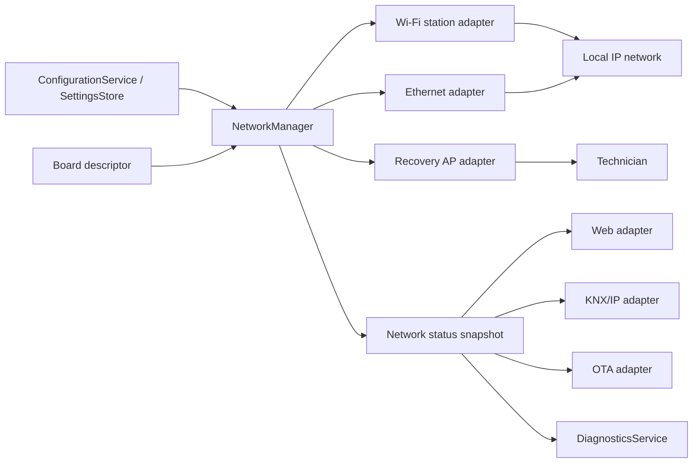
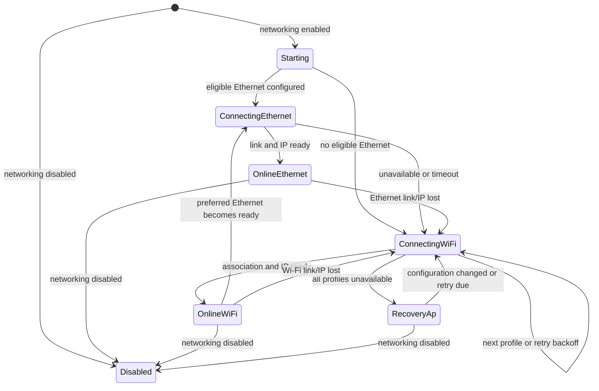

# Network Architecture Requirements
**Important** Ethernet manaager is out of scope in the current implementation.

## 1. Purpose and Status

This document defines the normative Wi-Fi and Ethernet requirements for the Switch Actuator firmware. It applies to IP connectivity used by the web interface, KNX/IP, OTA updates, time synchronization, diagnostics, and future IP-based integrations.

The keywords **MUST**, **MUST NOT**, **SHOULD**, **SHOULD NOT**, and **MAY** are requirements. This design is informed by WLED's proven model of multiple saved Wi-Fi networks, automatic recovery access-point mode, and optional wired Ethernet, but it is adapted to a safety-oriented relay actuator.

The firmware MUST use C++17 and follow the ports-and-adapters dependency rules in `design/software-architecture-instructions.md`.

## 2. Design Goals

The network subsystem shall:

- provide reliable local-network connectivity without delaying or controlling relay safety behavior;
- support Wi-Fi station mode and optional Ethernet on supported hardware;
- reconnect autonomously after a link, access-point, DHCP, or router failure;
- provide a deliberate, locally accessible recovery/provisioning path when no configured network is reachable;
- make the active transport and assigned addresses observable to the web UI, CLI, diagnostics, and dependent adapters;
- preserve complete network configuration atomically in the existing versioned settings store;
- keep credentials and management services protected from unauthorized network access.

Network loss MUST NOT change relay outputs, reset relay state, block local button/CLI operation, or prevent Modbus RTU processing. IP protocol adapters MUST report their unavailable state while retaining the actuator's normal relay control behavior.

## 3. Scope and Hardware Capability

The current Waveshare ESP32-S3-Relay-6CH board includes ESP32-S3 Wi-Fi but has no integrated Ethernet PHY, RJ45 connector, or board-defined Ethernet pin assignment. Therefore:

- Wi-Fi support is a required capability of the current board.
- Ethernet support is an optional platform capability, not a promise that the current board can use Ethernet without verified additional hardware.
- A board descriptor MUST declare `wifiSupported`, `ethernetSupported`, and the Ethernet implementation type.
- An Ethernet-capable descriptor MUST include all required MAC/PHY or SPI-controller parameters, pin assignments, PHY reset behavior, clock mode, and optional power-enable pin.
- Ethernet MUST remain unavailable unless its descriptor, physical interface, and build support are all present and validated.
- The implementation MUST NOT reuse relay, RS-485, BOOT, buzzer, or WS2812 pins for Ethernet unless a board-specific schematic confirms electrical compatibility and the board descriptor assigns them.

As WLED's Ethernet guidance demonstrates, Ethernet support is hardware-specific and consumes non-interchangeable pins. A generic Ethernet toggle without a validated board descriptor is prohibited.

## 4. Logical Architecture

`NetworkManager` is the single owner of Wi-Fi, Ethernet, recovery access-point, IP address, and reconnect state. It SHALL be implemented in an infrastructure adapter layer, with a narrow application-facing port such as `NetworkStatusPort`.

Application and domain code MUST NOT include Arduino `WiFi.h`, `ETH.h`, event-loop types, IP-address types, or credentials. Web, KNX/IP, OTA, NTP, and future IP adapters MUST consume `NetworkStatusPort`; they MUST NOT call `WiFi.begin()`, change Wi-Fi mode, start an access point, or initialize Ethernet themselves. In particular, the existing KNX/IP adapter MUST be refactored to wait for the manager's usable-network state rather than owning station-mode initialization.

## 5. Network Configuration

Network configuration MUST be a versioned domain value and MUST be validated before persistence or activation. It shall contain at least:

| Field | Requirement |
|---|---|
| `enabled` | Enables IP networking without disabling local control. |
| `hostName` | RFC-compatible local host label; default derived from board model and stable device identity. |
| `preferredTransport` | `ethernetFirst`, `wifiFirst`, or `auto`; default is `ethernetFirst` on Ethernet-capable boards and `wifiFirst` otherwise. |
| `wifiProfiles` | One to three ordered SSID/credential profiles; empty SSIDs are invalid. |
| `wifiProfiles[n].ipMode` | Per-profile DHCP or complete static IPv4 configuration. |
| `ethernet` | Enable flag plus DHCP or complete static IPv4 configuration and the board-supported Ethernet type. |
| `recoveryAp` | Enable flag, SSID prefix, WPA2 passphrase, channel, timeout policy, and web-management policy. |
| `services` | Per-service enablement and authentication policy for web, OTA, KNX/IP, time sync, and discovery. |

Static IPv4 configuration MUST contain address, subnet mask, gateway, and at least one DNS server. The configuration service MUST reject malformed addresses, a zero subnet mask, a gateway outside the configured subnet, duplicate Wi-Fi SSIDs, more than three profiles, and an incomplete static configuration. IPv6 is out of scope for the first implementation.

Wi-Fi credentials, recovery-AP passphrases, and management passwords are secrets. They MUST NOT be logged, returned by an unauthenticated endpoint, included in diagnostic exports, or exposed in configuration readback. Browser/API updates that omit a secret MUST preserve the existing value unless an explicit clear operation is requested.

## 6. Connectivity State Machine

The manager MUST publish one snapshot with a monotonically increasing state sequence. The snapshot shall include lifecycle state, active transport, link status, IP configuration status, IPv4 address, gateway, DNS servers, RSSI for Wi-Fi, active profile index, recovery-AP state, last failure reason, and timestamps for state change and successful connection.

The manager MUST treat a transport as online only after its physical or association state is up and its configured IP acquisition has completed. Link-up alone, an empty address, or `0.0.0.0` is not online.

### 6.1 Transport Selection and Failover

- If Ethernet is configured, supported, and selected by the preference policy, the manager MUST attempt it first.
- When Ethernet has not obtained link and IP within a configurable bounded startup timeout, the manager MUST attempt Wi-Fi without waiting indefinitely.
- Wi-Fi profiles MUST be attempted in configured priority order. Each profile attempt MUST have a bounded association/IP timeout.
- The manager MUST use exponential reconnect backoff with a bounded maximum delay and randomized jitter. It MUST reset the backoff after a sustained successful connection.
- When all Wi-Fi profiles fail, the recovery AP MUST be started if enabled. Station reconnect attempts MUST continue in the background without disrupting the recovery AP.
- When a more-preferred transport becomes usable, the manager MUST switch only after it has remained healthy for a configurable stability interval. This prevents flapping between Wi-Fi and Ethernet.
- During a transport change, dependent adapters MUST receive a down event before an up event and MUST re-establish their own sessions. Relay command processing MUST continue.
- If Wi-Fi and Ethernet are intentionally both online, the manager MUST designate exactly one default service transport. Service listeners and outbound sockets MUST NOT bind ambiguously; the status snapshot MUST show both addresses.

Default timing values SHOULD be: 15 seconds Ethernet acquisition, 20 seconds per Wi-Fi profile, 30 seconds before starting recovery AP, 1 second initial retry delay, 60 seconds maximum retry delay, and 30 seconds preferred-transport stability. Exact constants MUST be configuration-backed or documented build defaults and covered by tests.

### 6.2 Recovery Access Point and Provisioning

The recovery AP is for local commissioning and repair, not normal operation.

- It MUST use WPA2-PSK or stronger; an open AP is prohibited in production builds.
- Its default SSID MUST use a device-unique suffix and MUST NOT reveal Wi-Fi credentials or the full device serial number.
- Its initial passphrase MUST be unique per device or require a local commissioning action before activation. A repository-wide default password is prohibited.
- The AP management surface MUST require authentication before viewing or changing configuration.
- The recovery AP MUST expose only the minimum provisioning, diagnostics, and firmware-recovery endpoints; KNX/IP and relay-control APIs MUST remain unavailable through it unless explicitly enabled by an authenticated commissioning policy.
- A configuration change submitted through provisioning MUST be validated, atomically persisted, and then trigger a controlled network reconfiguration. It MUST NOT reboot the relay application merely to apply credentials.
- The AP MAY remain active while there is no usable infrastructure connection. Once infrastructure networking is stable, it SHOULD stop after the configured timeout unless explicitly configured to remain active for commissioning.

## 7. IP Services and Discovery

The manager MUST assign the configured hostname to the active interface before starting IP services. The hostname MUST be stable across DHCP leases and configuration restarts. mDNS service advertisement MAY be supported for the authenticated web UI and OTA only after the transport is online.

Web, OTA, KNX/IP, NTP, and discovery services MUST:

- start only after receiving a usable-network up event;
- stop or enter a clearly unavailable state immediately when their selected transport goes down;
- use non-blocking polling or event callbacks and bounded work per scheduler cycle;
- tolerate duplicate up/down notifications and reconnect without leaking sockets or tasks;
- expose health and last error through diagnostics.

Web management and OTA MUST be disabled until the device has a non-default administrator credential. OTA images MUST be authenticated using the platform-supported mechanism before activation. The initial implementation MUST NOT expose unauthenticated remote relay control, configuration writes, firmware updates, or factory reset.

Network discovery and broadcast/multicast traffic MUST be limited to the active LAN interface. It MUST NOT be bridged or forwarded through the recovery AP.

## 8. Reliability, Safety, and Diagnostics

Network operations MUST be asynchronous. The manager and adapters MUST NOT use long delays, wait indefinitely for DHCP, perform relay actions in network event callbacks, or hold a lock while invoking protocol callbacks, NVS writes, GPIO access, or logging.

The network subsystem SHALL define bounded queues and explicit overflow behavior for incoming web/API commands. Network command acceptance MUST use the same `SwitchingPolicyService` and relay-command queue as every other command source. A network outage, reconnect storm, malformed packet, or full network queue MUST NOT starve safety-off commands.

Diagnostics MUST report at least:

- current network state and active/default transport;
- Ethernet link state and IP acquisition result when Ethernet is configured;
- selected Wi-Fi profile index, SSID only when authenticated locally, RSSI, disconnect reason, and reconnect count;
- active and recovery-AP IPv4 addresses without exposing passphrases;
- DHCP/static configuration outcome, DNS failure count, service health, and last network error;
- state-transition and reconnect timestamps using monotonic time for ordering.

Loss of an optional IP service is a warning-level diagnostic fault. Failure of all infrastructure network paths is a warning-level `NetworkUnavailable` fault. Neither fault may force relay outputs off unless a separately configured safety policy explicitly requires it.

## 9. Lifecycle, Persistence, and Reset

During boot, the firmware MUST initialize relays to their safe inactive state, validate settings, construct the relay application services, and then start the network manager. Network initialization MUST NOT delay safe relay initialization or restore-policy evaluation.

Configuration updates MUST use the existing dual-slot, CRC-protected, generation-based persistence process. The manager MUST continue using the last known valid configuration if a new network configuration is invalid or persistence fails.

Factory reset MUST require the deliberate local BOOT-button gesture defined by the board architecture. A remote factory-reset endpoint is prohibited unless a future security ADR defines a strongly authenticated, physical-presence-confirmed recovery flow. Reset MUST erase network secrets and stop the recovery AP before restarting the normal configuration lifecycle.

## 10. Acceptance Criteria

The implementation is complete only when automated tests and hardware validation demonstrate all of the following:

- no configured network starts a protected recovery AP and keeps relays and Modbus RTU operational;
- the manager connects to the first reachable profile, then tries the next profile after the configured bounded timeout;
- a Wi-Fi disconnect reconnects with bounded exponential backoff and does not reset relay state;
- a supported Ethernet board obtains an address and takes precedence according to configuration;
- Ethernet link loss falls back to Wi-Fi, and a stable preferred Ethernet link later becomes the active service transport without command loss;
- DHCP and valid static IPv4 configurations work for each supported transport, while incomplete or invalid static settings are rejected before persistence;
- dependent services do not start before a usable network state and recover correctly across transport changes;
- credentials never appear in serial logs, diagnostics, unauthenticated API responses, or exported configuration;
- malformed network traffic and repeated reconnect events do not block the application task, exhaust queues, or bypass `SwitchingPolicyService`;
- the Waveshare board reports Ethernet as unavailable unless a verified Ethernet-capable board descriptor is selected.

## 11. References

- [WLED source repository](https://github.com/wled/WLED): multiple Wi-Fi profiles, automatic AP fallback, optional Ethernet support, and OTA operation.
- [WLED Ethernet compatibility guidance](https://kno.wled.ge/features/ethernet-lan/): Ethernet requires board-specific hardware, pin assignments, and compiled support.
- `design/software-architecture-instructions.md`: firmware layering, lifecycle, safety, persistence, and command-arbitration requirements.
