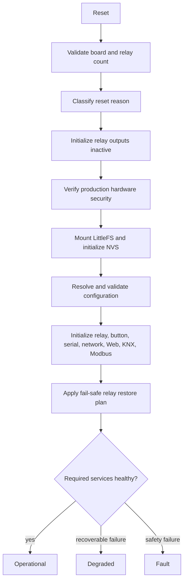

# Boot Flow

## Purpose

Boot establishes relay safety, hardware trust, configuration ownership, and
adapter availability before the device becomes operational. Startup must remain
deterministic when storage, configuration, networking, or a protocol adapter is
unavailable.

## Invariants

- Relay GPIO is never restored directly from storage or a protocol callback.
- Every relay starts inactive and any restoration passes through relay policy.
- Production security checks fail closed before network services start.
- Invalid configuration never becomes active partially.
- Storage fallback does not hide the fault that caused fallback.
- `Operational`, `Degraded`, and `Fault` describe application health; service
  mode is a separate, physical-presence authorization state.

## Sequence

The implemented order is:

1. Clear runtime queues, sessions, timers, scenes, and service authorization.
2. Validate that the selected board descriptor matches the compiled relay
   count. An incompatible product target is rejected.
3. Classify power-on, controlled restart, brownout, watchdog, panic, or
   repeated-boot reset and update persistent diagnostic counters.
4. Initialize the relay BSP. All channels are driven to their inactive level.
   Failure enters `Fault` and stops startup.
5. In production, require Secure Boot v2 and flash encryption. Missing hardware
   security state enters `Fault` before network and protocol initialization.
6. Initialize status indicators and enter configuration loading.
7. Mount LittleFS without automatic formatting, initialize NVS, checkpoint boot
   diagnostics, and resolve configuration using the precedence below.
8. Construct device identity from validated configuration, compiled product
   data, board data, firmware version, and the eFuse MAC address.
9. Initialize relay command handling, the BOOT button, serial CLI, networking,
   protected Web security, HTTPS/WebSocket, KNX/IP, and Modbus RTU.
10. Compute the reset-specific relay restoration plan and execute it through
    the same command service used at runtime.
11. Enter `Operational` when required dependencies are healthy, otherwise enter
    `Degraded` for recoverable adapter/storage/configuration failures.
12. Start the task watchdog only after the final lifecycle state is established.

## Configuration Precedence

Configuration is selected in this order:

1. newest valid transactional NVS generation;
2. complete valid LittleFS `/config/*.json` bundle;
3. complete valid LittleFS `/config/.backup/*.json` bundle;
4. embedded `config/default_configuration.json`;
5. safe domain defaults with relay restoration disabled.

The active configuration remains owned by `ConfigurationService` regardless of
source. See [Filesystem architecture](filesystem.md) and
[Product configuration](../product/configuration.md).

## Lifecycle Outcomes

| Outcome | Typical causes | Relay behavior |
|---|---|---|
| `Operational` | Configuration and required adapters healthy | Validated restore policy applies |
| `Degraded` | Invalid configuration, NVS/LittleFS fault, unavailable Modbus/KNX/CLI | Policy remains active; affected capability is unavailable |
| `Fault` | Relay output failure, incompatible board, missing production security, watchdog failure | Relays are forced or kept inactive and command paths reject unsafe work |

## Controlled Restart

Configuration changes that require restart request a lifecycle-controlled
restart. The application drains the bounded response window, checkpoints dirty
diagnostic counters, stops Web/network/UART services, and then restarts. A
restart must not bypass the next boot's security, configuration, or relay-safe
sequence.
