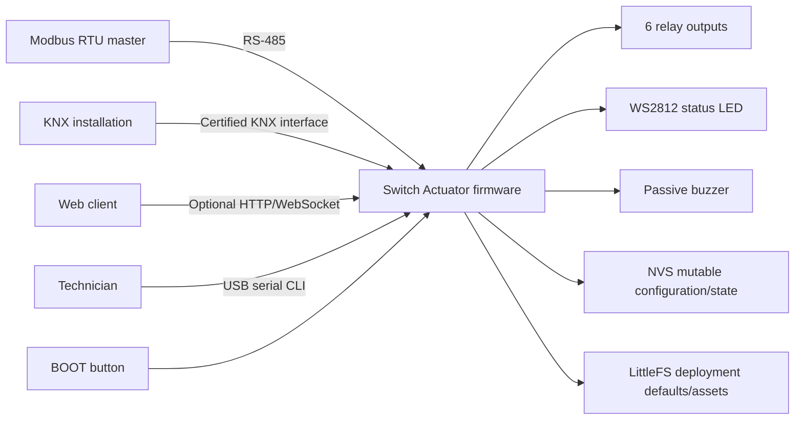
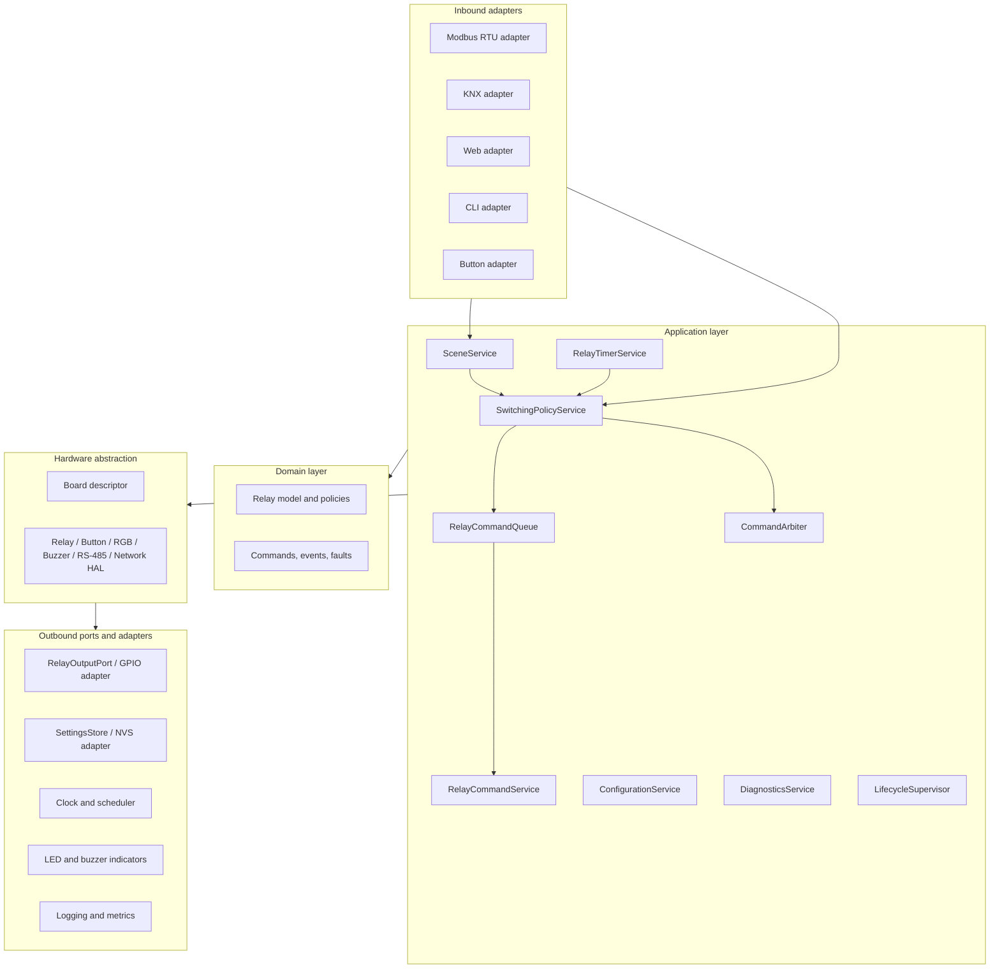

# System Architecture

## 1. Purpose and Status

This document is the normative architecture specification for the Switch Actuator firmware. It defines how the ESP32-S3 device controls multiple relays and exposes them through Modbus RTU, KNX, local controls, diagnostics, and an optional web interface.

The keywords **MUST**, **MUST NOT**, **SHOULD**, **SHOULD NOT**, and **MAY** are requirements. New firmware code and refactoring of existing code MUST follow this document unless an approved architecture decision record (ADR) explicitly supersedes a requirement.

The initial production target is the Waveshare ESP32-S3-Relay-6CH board using the Arduino framework. The design MUST remain portable to future actuator boards through a board-support package (BSP); protocol and application code MUST NOT contain board pin numbers.

## 2. Product Scope

The firmware shall:

- control six independent relay channels safely and deterministically;
- expose relay commands, state, configuration, and diagnostics over Modbus RTU;
- expose equivalent channel behavior through a production KNX stack when KNX hardware is fitted;
- accept local CLI and button commands through the same application service used by network protocols;
- preserve state and configuration safely across resets and power loss according to configured restore policy;
- remain responsive under malformed, high-rate, or unavailable protocol traffic;
- report actual applied state rather than merely echoing a requested state;
- support production diagnostics, firmware identification, and controlled recovery.

Out of scope for the domain core are HTML rendering, protocol framing, GPIO register access, storage format details, and vendor library types. These concerns belong in adapters.

## 3. Architectural Drivers

The order of priorities is:

1. Electrical and operational safety.
2. Deterministic relay behavior.
3. Availability of local control and protocol communication.
4. Correctness and observability.
5. Maintainability and portability.
6. Performance and resource efficiency.

The firmware MUST use C++17. The build configuration MUST select `-std=gnu++17` or `-std=c++17` consistently and MUST NOT enable C++20. C modules such as NanoModbus MAY remain C11-compatible and MUST be wrapped by a typed C++ adapter before use by application code.

Dynamic allocation after startup SHOULD be avoided. Timing-critical and frequently executed paths MUST use fixed-capacity storage. Exceptions, RTTI, and virtual dispatch MUST NOT be introduced unless their memory, timing, and failure behavior are measured and justified in an ADR.

Concrete ownership, capacities, task stacks, synchronization boundaries,
shutdown order, heap thresholds, and PSRAM policy are normative in
[Resource management](../../design/resource-management.md). A component MUST NOT start,
stop, resize, or delete a resource owned by another component.

## 4. System Context



Modbus, KNX, web, CLI, and button inputs are untrusted command sources. No input source may drive GPIO directly. Every request MUST pass through validation, authorization where applicable, command arbitration, and the relay application service.

## 5. Logical Architecture

The implementation shall follow ports-and-adapters boundaries with one-way dependencies toward the domain.



### 5.1 Dependency Rules

- Domain code MUST be standard C++17 and testable on a host without Arduino headers.
- Application code MAY depend on domain types and abstract ports, but MUST NOT depend on NanoModbus, a KNX library, HTTP server classes, `HardwareSerial`, GPIO APIs, NVS APIs, or global singletons.
- Inbound adapters translate external representations into typed application commands.
- Outbound adapters implement hardware, clock, persistence, and reporting ports.
- Protocol adapters MAY query snapshots but MUST NOT own authoritative relay state.
- The composition root is the only code that constructs concrete adapters and connects dependencies.
- Cross-layer access through global mutable state or singleton lookup is prohibited.
- Application-specific result enums MUST be translated to `domain::ErrorCode`
	before crossing a protocol boundary. Protocol adapters MUST exhaustively map
	the domain code to HTTP, Modbus, KNX, or other native representations and
	MUST NOT invent independent string error taxonomies.
- Hardware contracts and board selection live in `src/hal`. Application and
	domain services MUST NOT include a product-specific board header or use GPIO,
	LEDC, UART, Wi-Fi, or Arduino APIs directly.
- Concrete BSP adapters implement HAL contracts. Product selection is confined
	to `hal::board()` in the composition layer.

## 6. Domain Model

### 6.1 Required Types

The core shall use explicit types equivalent to:

```cpp
enum class RelayState : std::uint8_t { Off, On };
enum class RelayAction : std::uint8_t { SetOff, SetOn, Toggle };
enum class CommandSource : std::uint8_t { Safety, Button, Knx, Modbus, Web, Cli, Restore };
enum class RestorePolicy : std::uint8_t { AllOff, LastKnown, ConfiguredDefault };

struct RelayChannelId final {
		std::uint8_t value; // Valid range is [0, channelCount).
};

struct RelayCommand final {
		RelayChannelId channel;
		RelayAction action;
		CommandSource source;
		std::uint32_t correlationId;
		std::uint32_t receivedAtMs;
};
```

Actual names may follow repository conventions, but the concepts and type safety are mandatory. Bare integers MUST NOT cross the adapter/application boundary as channel identifiers, actions, or command sources.

### 6.1.1 Error Contract

`domain::ErrorCode` is the protocol-neutral failure vocabulary:

```cpp
enum class ErrorCode {
	InvalidArgument,
	Unauthorized,
	Forbidden,
	NotFound,
	Busy,
	StorageError,
	ConfigurationError,
	HardwareError,
	NetworkError,
	ProtocolError,
	Unsupported,
	InternalError
};
```

The required flow is `application result -> domain::ErrorCode -> protocol
representation`. A successful operation is represented separately, currently
as an empty `std::optional<ErrorCode>`, and MUST NOT be encoded as an error.
Mappings belong in `app/error_mapping.h` and each protocol adapter's
`*_error_representation.h`. Lossy mappings, such as several domain errors
collapsing to Modbus server device failure or KNX silent rejection, MUST be
explicit and covered by tests.

### 6.2 Authoritative State

`RelayCommandService` owns the authoritative logical state of every relay. A channel state transition is complete only after the output adapter has accepted and applied it. The resulting state is then published as a `RelayStateChanged` event and made visible to all adapters.

Each channel snapshot MUST contain at least:

- requested state;
- applied state;
- last command source;
- monotonic transition sequence number;
- last transition timestamp;
- fault/lockout state.

If output readback is not electrically available, `applied state` means the last successfully written GPIO state, not physical contact verification. User-facing diagnostics MUST distinguish commanded state from verified contact state.

### 6.3 Command Semantics

- `SetOff` and `SetOn` are idempotent.
- `Toggle` is edge-triggered and executes exactly once per accepted request.
- Re-reading a protocol register or polling an adapter MUST NOT repeat a toggle.
- An invalid channel, action, or unavailable/locked channel MUST return a typed rejection and MUST NOT alter any state.
- State-change events MUST be emitted only when applied state changes. A command result is still returned for an idempotent no-op.
- Multi-channel operations MUST be validated fully before application. Unless a protocol explicitly supports partial success, they are all-or-none at the application boundary.

### 6.4 Arbitration

Safety commands have highest priority and may force one or more channels off. While safety lockout is active, ordinary on/toggle requests MUST be rejected.

Among non-safety sources, the default policy is deterministic last-accepted-command-wins using the application task's serialized receive order. Wall-clock time MUST NOT be used for ordering. Deployments needing manual override, interlock, mutually exclusive channels, or source priority MUST implement those as explicit `SwitchingPolicyService` policies delegated to `CommandArbiter`, not as protocol-specific conditions. Staircase and other deadline behavior belongs to `RelayTimerService` and is revalidated through `SwitchingPolicyService` when due.

Every accepted or rejected command MUST produce a result containing the correlation ID, final state, and reason code. Protocol adapters translate reason codes into protocol-native responses.

### 6.5 Relay Startup And Disturbance Safety

Relay behavior during power-on, brownout, watchdog reset, software reboot, OTA
reboot, factory reset, configuration update, and network failure is defined by
[Relay safety policy](../../design/relay-safety-policy.md). That decision table is normative. Unknown reset
causes and unavailable state always fail safe to OFF.

### 6.6 Application Switching Services

Advanced switching behavior MUST be divided among three protocol-neutral application services. These services MUST use domain types and abstract ports only; they MUST NOT include Arduino, KNX, Modbus, HTTP, GPIO, NVS, or vendor-library types.

`SwitchingPolicyService` is the single application entry point for immediate single-channel and multi-channel switching requests from KNX, Modbus, CLI, web, buttons, restore, scenes, and expired timers. It shall:

- validate typed channels, actions, sources, lifecycle eligibility, lockout, forced operation, interlocks, mutually exclusive groups, and other configured switching policies;
- use `CommandArbiter` for arbitration decisions rather than duplicating arbitration rules;
- construct bounded `RelayCommand` or all-or-none command batches and submit them to `RelayCommandQueue`;
- return typed accepted, deferred, rejected, and queue-full results without changing GPIO or authoritative relay snapshots;
- preserve the source and correlation ID of the initiating request through scene expansion and timer expiry.

`SceneService` owns scene recall and learning behavior. It shall:

- map configured scene numbers to bounded per-channel target states and validate the complete scene before application;
- submit recalls through `SwitchingPolicyService` as one all-or-none operation;
- learn from current applied-state snapshots, never requested, optimistic, or pending states;
- stage learned values through `ConfigurationService`; protocol callbacks and scene handling MUST NOT write NVS directly;
- remain disabled and expose no scene objects when scene configuration or persistence support is unavailable.

`RelayTimerService` owns delayed and duration-based switching behavior, including on/off delay, staircase time, minimum on/off time, maximum on time, warning deadlines, and bounded deferred commands. It shall:

- use fixed-capacity per-channel state and wrap-safe unsigned monotonic deadlines;
- retain at most the configured bounded number of pending operations and define replacement, cancellation, and queue-full behavior explicitly;
- perform no blocking waits, dynamic allocation, GPIO access, persistence writes, or protocol callbacks;
- resubmit each due operation through `SwitchingPolicyService` so current safety, lockout, interlock, and lifecycle policies are revalidated at execution time;
- cancel volatile timers during restart unless persisted timer restoration is explicitly configured, failure-atomic, and covered by tests.

`RelayCommandService` remains the sole owner of authoritative requested/applied relay snapshots and output application. `SceneService`, `RelayTimerService`, and `SwitchingPolicyService` MUST NOT mutate those snapshots directly. Dependency direction is `SceneService -> SwitchingPolicyService`, `RelayTimerService -> SwitchingPolicyService`, and `SwitchingPolicyService -> RelayCommandQueue`; reverse dependencies are prohibited. The composition root constructs and connects all services.

## 7. Hardware and BSP

### 7.1 Waveshare ESP32-S3-Relay-6CH Map

| Function | GPIO | Direction | BSP requirement |
|---|---:|---|---|
| BOOT button | 0 | Input | Boot strapping pin; never drive as output |
| Relay CH1 | 1 | Output | Polarity supplied by board descriptor |
| Relay CH2 | 2 | Output | Polarity supplied by board descriptor |
| RS-485 TX | 17 | Output | UART1 TX |
| RS-485 RX | 18 | Input | UART1 RX |
| Buzzer | 21 | Output | Passive buzzer/PWM |
| WS2812 RGB | 38 | Output | Status indicator |
| Relay CH3 | 41 | Output | Polarity supplied by board descriptor |
| Relay CH4 | 42 | Output | Polarity supplied by board descriptor |
| Relay CH5 | 45 | Output | Polarity supplied by board descriptor |
| Relay CH6 | 46 | Output | Polarity supplied by board descriptor |

The board descriptor MUST be compile-time immutable and use `constexpr std::array` for relay pins. It MUST include channel count, relay polarity, inactive GPIO level, UART assignment, indicator capabilities, and hardware revision.

Relay polarity MUST be verified against the board schematic and a physical sample before release. It MUST NOT be inferred from the current third-party `Relay` library behavior.

### 7.2 Safe GPIO Initialization

The GPIO adapter MUST establish the inactive output level before enabling each relay pin as an output, using the safest sequence supported by the ESP32 GPIO driver. All relays MUST remain off until configuration is validated and restore policy is evaluated. Constructors and static initialization MUST NOT touch hardware.

GPIO0 handling requirements:

- configure only as an input with the board-required pull mode;
- never block or alter ROM download/boot strapping behavior;
- ignore reset/factory-reset gestures during the boot qualification interval;
- require a deliberate long press and release before destructive action;
- never erase configuration directly in an interrupt or button callback.

### 7.3 RS-485 and KNX Hardware

UART1 is reserved for Modbus RTU on GPIO17/GPIO18 for this board. RS-485 driver-enable control MUST be implemented only if required by the fitted transceiver; auto-direction behavior MUST be verified from the board schematic. The design MUST NOT invent or reuse an unverified GPIO for DE/RE.

KNX MUST NOT share the Modbus UART. Production KNX support requires a compatible physical interface and a maintained/certifiable KNX stack. The selected transport (for example KNX TP-UART or KNX/IP) and its pins/network interface MUST be captured in a board-specific ADR before implementation. A build without that hardware MUST compile with a `NullKnxAdapter` and report KNX as unavailable.

## 8. Runtime and Concurrency Model

The preferred baseline is a cooperative, non-blocking scheduler in one application task. Protocol libraries that require dedicated FreeRTOS tasks MAY use them, but all relay commands MUST be serialized through one bounded command queue consumed by the application task.

Recommended execution model:

| Work item | Maximum interval | Rule |
|---|---:|---|
| Relay command processing | 10 ms | Highest normal application priority |
| Modbus RTU polling | 2 ms while active | Never wait 1 second in the main loop |
| KNX processing | Stack-specific, at most 10 ms | Non-blocking adapter step |
| Button sampling | 10 ms | Debounced, event-producing |
| LED/buzzer update | 20 ms | Non-blocking state machine |
| Diagnostics | 1000 ms | Incremental; no large formatting burst |
| Persistence flush | Debounced 1000 ms or controlled shutdown | Never write on every relay transition |

These are initial budgets and MUST be verified under maximum supported bus load. No production loop path may call an unbounded `delay()`, perform blocking tone playback, generate random register values, or repeatedly construct dynamic strings/vectors.

Shared data requirements:

- Single-writer ownership is preferred.
- Cross-task communication MUST use bounded queues or snapshots.
- Queue-full behavior MUST be explicit: safety-off commands must have reserved capacity; ordinary commands are rejected and counted.
- A mutex MAY protect adapter-local library state but MUST NOT be held during GPIO, storage, logging, or protocol callbacks.
- ISRs may only capture minimal data and notify a task; they MUST NOT execute domain logic.
- Unsigned monotonic subtraction MUST be used for wrap-safe `millis()` deadlines.

The task watchdog MUST supervise the application task and any protocol task whose failure can prevent safe operation. Watchdog recovery MUST result in the configured safe startup sequence.

## 9. Boot, Shutdown, and Recovery

Boot proceeds in this order:

1. Capture reset reason and initialize minimal logging.
2. Select and validate the compile-time board descriptor.
3. Drive all relay channels to the inactive state.
4. Initialize status LED and show boot state without blocking.
5. Mount LittleFS once without automatic formatting; record a filesystem fault on failure.
6. Open NVS and load both configuration slots.
7. Validate schema version, length, range, and CRC; select the newest valid generation.
8. If NVS has no valid configuration, try the validated seven-file LittleFS `/config/` bundle, its complete `/config/.backup/` bundle, and embedded `config/default_configuration.json`, in that order.
9. If no JSON source provides a valid configuration, load safe defaults, keep relays off, and expose a configuration fault.
10. Construct domain services and initialize the command queue.
11. Initialize Modbus, optional KNX/network adapters, CLI, and button input.
12. Apply restore policy through `RelayCommandService`, never by direct GPIO writes.
13. Enter operational state and enable the watchdog.

On brownout, watchdog reset, panic, invalid configuration, or repeated boot failure, the default behavior is all relays off. Restoring `LastKnown` after an abnormal reset MUST be an explicit deploy-time option and SHOULD default to disabled.

The lifecycle state machine is `Booting -> Configuring -> Operational -> Degraded/Fault -> Restarting`. Adapters MUST expose lifecycle state and MUST reject unsafe requests when the application is not operational.

## 10. Persistence and Configuration

Configuration MUST be represented as a versioned domain value object. At minimum it contains:

- schema version and generation counter;
- board model and hardware revision;
- device serial number and stable UUID provisioned per device;
- Modbus unit ID, baud rate, parity, data bits, and stop bits;
- per-channel enabled flag, restore policy, and configured default state;
- KNX individual address and group-object bindings when enabled;
- web/network/security settings when enabled;
- indicator and diagnostics policy.

Hard-coded serial numbers and UUIDs are forbidden in production images.

The NVS adapter MUST use two records (A/B) with generation, payload length, schema version, and CRC. It writes the inactive record, verifies it, then marks the generation current. A reset at any point MUST leave at least one valid record. Schema migration MUST be explicit and covered by tests.

Configuration changes follow `validate -> stage -> persist -> apply`. Changes that alter an active transport MAY respond successfully only after persistence succeeds and MUST state whether a controlled restart is required. Invalid configuration MUST never partially apply.

The repository-level `data/config/` directory is the data-driven deployment source and MUST contain `system.json`, `network.json`, `wifi.json`, `ethernet.json`, `knx.json`, `modbus.json`, and `ui.json`. PlatformIO packages these paths into LittleFS. The repository-level `config/default_configuration.json` MUST remain embedded as an immutable recovery fallback so normal firmware flashing does not depend on a separately uploaded filesystem image. The filesystem adapter MUST reject a missing section, malformed JSON, incorrectly typed required fields, wrong fixed-array lengths, unsupported Ethernet enablement, out-of-range text, invalid UUID syntax, oversized section, and any value rejected by domain validation. Assembly and parsing MUST be failure-atomic: active configuration changes only after the complete seven-file bundle is accepted.

Configuration precedence is `valid NVS generation -> valid LittleFS /config bundle -> valid LittleFS backup bundle -> valid embedded JSON -> safe domain defaults`. An empty NVS store on first boot is normal when JSON is valid. Corrupt or inaccessible NVS MUST still raise a persistence fault and degraded lifecycle state even when JSON fallback permits operation. LittleFS mount failure MUST NOT auto-format storage; it raises a filesystem fault and uses the embedded fallback. Factory reset locks relays off, transactionally persists safe user defaults, preserves manufacturing and factory security identity, and restarts. Production bundles MUST replace development placeholder identity values with deployment-specific provisioning data and MUST NOT store secrets in filesystem configuration. Detailed reset semantics are defined in [Factory reset](../manufacturing/factory-reset.md); ownership, recovery, and web-serving rules are defined in [Filesystem architecture](filesystem.md).

Relay state persistence MUST be wear-aware. Coalesce changes, rate-limit writes, and store a compact bitmask plus generation and CRC. Safety-critical installations SHOULD use `AllOff` restore policy instead of frequent last-state persistence.

## 11. Modbus RTU Adapter

### 11.1 Transport

The device defaults to the Modbus RTU server role and MAY switch dynamically between server and client roles through an authorized maintenance CLI command. Role changes are runtime-only, MUST NOT reconfigure the UART, and MUST NOT require a restart. Returning to server role MUST restore the configured unit ID and register callbacks. Defaults are unit ID 10 and 115200 8N1 only for development compatibility; production defaults MUST be documented and configurable. Valid unit IDs are 1 through 247. Address 0 is broadcast and MUST NOT generate a response.

Client transactions MUST be explicitly initiated through a typed control port; application and CLI code MUST NOT depend directly on NanoModbus. Client requests MUST use bounded buffers and bounded response timeouts. The maintenance CLI supports holding-register reads of 1 through 20 registers and single-register writes to destinations 1 through 247. Client transactions and role changes MUST require maintenance authorization when mutating CLI commands are enabled.

RTU framing and inter-frame timing MUST follow the configured baud rate. Byte/read timeouts MUST be derived from character time and frame limits; fixed one-second blocking reads are prohibited. The adapter MUST count CRC errors, malformed frames, illegal function/address/value requests, timeouts, queue saturation, and valid requests.

Supported function codes are:

- `0x01`, `0x05`, `0x0F` for relay coils when the canonical coil mapping is enabled;
- `0x03`, `0x06`, `0x10` for the legacy V1 holding-register mapping and configuration;
- `0x04` for read-only status/diagnostic input registers;
- `0x2B/0x0E` for real device identification values.

Unsupported functions MUST return `Illegal Function`. Out-of-range addresses MUST return `Illegal Data Address`; invalid values or invalid multi-register combinations MUST return `Illegal Data Value`. Address arithmetic MUST be overflow-safe and bounds checks MUST use `quantity <= size - address` after validating `address <= size`.

### 11.2 Register Ownership

The Modbus data model is a projection of domain/configuration snapshots, not mutable application memory. Write callbacks MUST parse and validate a complete request, enqueue typed commands, and return a protocol result. They MUST NOT expose raw register-array pointers or allow application code to poll writable memory for changes.

### 11.3 Production Register Map

The normative product contract is [Modbus RTU](../protocols/modbus.md).
The table below is an architectural summary; if it differs from the product
contract, the versioned product contract governs externally observable behavior.

All addresses below are zero-based Protocol Data Unit addresses. Product manuals MAY additionally show one-based `4xxxx` notation but MUST label it clearly.

| Address | Count | Access | Meaning |
|---:|---:|---|---|
| Coil 0 | 6 | R/W | Canonical relay state CH1..CH6; write is `SetOff`/`SetOn` |
| Discrete input 0 | 6 | R | Relay applied state CH1..CH6 |
| Holding 32 | 6 | R/W | Legacy V1 relay command/state CH1..CH6 |
| Holding 48 | 4 | R/W | LED red, green, blue, brightness; values 0..255 |
| Holding 56 | 1 | W | Buzzer tone command; values 0..7 |
| Holding 128 | 1 | R/W | UART encoded settings; changes require validation/restart |
| Holding 130 | 1 | R/W | Modbus unit ID; values 1..247 |
| Holding 132 | 1 | R | Software version encoded as major/minor product value |
| Input 0 | 6 | R | Per-channel fault codes |
| Input 8 | 1 | R | Lifecycle state |
| Input 9 | 2 | R | Uptime seconds, unsigned 32-bit, high word then low word |
| Input 11 | 2 | R | Accepted/rejected command counters, saturating 16-bit |

The complete map, including reserved ranges and byte/word order, MUST live in one typed `ModbusRegisterMap` definition and be published in product documentation. Registers not explicitly defined are reserved and MUST reject access; clients MUST NOT depend on their value.

Legacy holding registers 32..37 behave as follows:

- write `0`: execute `SetOff`;
- write `1`: execute `SetOn`;
- write `2`: execute one `Toggle` edge;
- read: return only current state (`0` or `1`);
- after accepting `2`, no stored value of `2` may remain to retrigger later;
- a multi-register write is validated in full before any command is enqueued.

Current storage sized only through holding register 128 is insufficient for addresses 130 and 132. The adapter implementation MUST use the typed sparse map or a correctly sized bounded representation; silently indexing beyond storage is prohibited.

Configuration writes SHOULD use a staged block plus an explicit commit register in the final map revision so partially transmitted settings cannot become active.

## 12. KNX Adapter

KNX support shall be implemented through a maintained stack suitable for the selected physical medium; protocol framing, commissioning, sequence handling, acknowledgements, retransmission, and datapoint encoding MUST NOT be hand-written.

The adapter exposes, for each enabled relay channel:

| Object | Direction | Datapoint type | Behavior |
|---|---|---|---|
| Switch command | Bus to device | DPT 1.001 | `0` off, `1` on |
| Switch status | Device to bus | DPT 1.001 | Published from applied-state events |
| Channel fault | Device to bus | Suitable configured 1-bit/alarm DPT | Published on change |

Optional central off, lockout, interlock, and forced-operation functions MUST be implemented through `SwitchingPolicyService`; scene functions MUST use `SceneService`; and delay, staircase, minimum-time, and maximum-on functions MUST use `RelayTimerService` before corresponding KNX group objects are exposed. A KNX callback MUST only decode the datapoint, resolve configured bindings, and invoke the appropriate application service. It MUST NOT construct protocol-specific switching policy, operate a relay directly, or mutate application snapshots. Status MUST come from the resulting domain event, avoiding optimistic echo.

The KNX adapter MUST support configurable individual address and group-address bindings, duplicate telegram handling, bus-loss diagnostics, and bounded retransmission. Commissioning/programming mode MUST require an explicit local action and visible indication. KNX key material, if KNX Secure is supported, MUST never appear in logs, CLI output, crash dumps, or web responses.

When Modbus and KNX are active simultaneously, both observe the same applied state and arbitration policy. A command received from one protocol MUST be reflected by the other protocol's next read/status publication.

## 13. Local, Web, and Indicator Adapters

### 13.1 CLI

The CLI is a maintenance adapter, not a privileged bypass. Relay CLI commands MUST enter through `SwitchingPolicyService`; scene and timer maintenance commands MUST use `SceneService` and `RelayTimerService` respectively. The CLI MUST NOT invoke `RelayCommandService` as a policy bypass. Parsing MUST reject missing, negative, overflowing, or trailing-invalid values instead of using unchecked `atoi`. Production builds MUST provide a way to disable mutating CLI commands or require a maintenance authorization state.

CLI output SHOULD provide stable machine-readable status in addition to concise human-readable output. Secrets and KNX/security keys MUST never be printed.

### 13.2 Button

Button callbacks produce events only. Suggested defaults are:

- short press: identify/status indication only;
- commissioning gesture: enter a time-limited commissioning mode;
- factory reset: long press of at least 10 seconds followed by release and visible confirmation.

Factory reset MUST erase application configuration using the persistence service and then restart into all-off state. The gesture MUST be tested to ensure it cannot interfere with ESP32-S3 download mode.

### 13.3 Optional Web Interface

The web interface is an optional adapter behind a build feature. Its API MUST use the same command and snapshot ports. State-changing endpoints require authentication, CSRF protection where browser cookies are used, strict payload limits, input validation, and request throttling. Firmware MUST remain fully controllable by configured field buses when the web subsystem is disabled or faulted.

### 13.4 LED and Buzzer

Indicators are outputs of a non-blocking status state machine. Priority is `critical fault > commissioning > degraded bus > command feedback > normal`. Protocol code MUST request semantic patterns, not RGB/PWM operations. Buzzer duration and duty cycle MUST be bounded.

## 14. Fault Handling and Safety

Faults shall be typed, severity-rated, timestamped, counted, and exposed through diagnostics. Required categories include:

- invalid or incompatible board/configuration;
- relay output application failure;
- command queue overflow;
- Modbus transport/protocol errors;
- KNX unavailable or bus-off;
- NVS read/write/CRC/migration failure;
- watchdog, brownout, panic, and repeated boot;
- resource exhaustion.

Expected malformed external input MUST produce a rejection, not an exception, assertion, reboot, or partial state update. Assertions are reserved for internal invariants during development. Production panic/restart policy MUST capture a bounded diagnostic record without persisting secrets.

If a fault makes output state uncertain, affected channels MUST transition to the configured safe state, defaulting to off, and enter lockout. Communication failure alone MUST NOT arbitrarily change relay state unless a configured fail-safe timeout policy explicitly requires it.

Relay interlocks, minimum on/off time, maximum on time, and mutually exclusive outputs are optional policies but, once configured, MUST be enforced centrally for every command source.

## 15. Security

Assume Modbus RTU and classic KNX provide limited or no authentication. Physical bus access is therefore part of the threat model. Deployers MUST isolate field buses and maintenance ports appropriately.

Firmware requirements:

- validate every length, address, enum, range, and state transition at trust boundaries;
- use secure boot and flash encryption for production where the deployment permits;
- disable or protect development endpoints and verbose logs in release builds;
- provision unique device identity; never ship common credentials or private keys;
- store secrets in protected storage and redact them from all diagnostics;
- rate-limit expensive operations and use bounded buffers;
- accept firmware updates only after image signature and compatibility verification;
- preserve the previous bootable image and use rollback if the new image fails health confirmation;
- factory reset MUST remove credentials and network/KNX configuration but MUST NOT disable secure boot.

A release threat model MUST cover malformed RTU frames, unauthorized bus commands, web attacks when enabled, downgrade/rollback, configuration corruption, and denial of service.

## 16. Observability

Logging MUST be structured by module and severity. Hot paths MUST not concatenate Arduino `String` or `std::string` values merely to log them. Rate-limit repeated errors and never log every scheduler iteration.

Diagnostics MUST expose:

- firmware version, build ID, board model/revision, reset reason, and uptime;
- lifecycle state and configuration validity;
- applied relay state, last source, transition counter, and per-channel fault;
- command accepted/rejected/queue-full counters;
- Modbus valid/error/timeout counters and active settings;
- KNX availability, bus state, and telegram error counters;
- NVS generation and last persistence error;
- heap low-water mark and task watchdog status where available.

Counters MUST be saturating or explicitly wrap with documented width. Device identification responses MUST use real provisioned/build values rather than placeholders.

## 17. Source Layout and Ownership

Target source organization:

```text
src/
	app/
		application.cpp
		lifecycle_supervisor.*
		relay_command_service.*
		switching_policy_service.h
		switching_policy_service.cpp
		scene_service.h
		scene_service.cpp
		relay_timer_service.h
		relay_timer_service.cpp
		command_arbiter.*
		configuration_service.*
		diagnostics_service.*
	domain/
		relay_types.h
		relay_policy.*
		configuration.*
		fault.*
	ports/
		relay_output_port.h
		settings_store.h
		clock_port.h
		event_sink.h
	adapters/
		bsp/
			board_descriptor.h
			waveshare_esp32s3_relay6ch.*
			esp32_relay_output.*
		modbus/
			modbus_rtu_adapter.*
			modbus_register_map.*
			nanomodbus/...
		knx/
			knx_adapter.*
			null_knx_adapter.*
		cli/
		web/
		filesystem/
		nvs/
		indicators/
	main.cpp
test/
	unit/
	integration/
	fakes/
```

Small deviations are acceptable when they improve clarity, but layer direction and ownership are not optional. Third-party sources MUST be isolated under their adapter, pinned to reviewed versions, and accompanied by license and update information.

## 18. Coding and API Rules

- Use C++17, RAII, value semantics, `enum class`, `std::array`, `std::optional`, and `string_view` where ownership is not transferred.
- Use `std::chrono` durations in domain/application interfaces; convert to Arduino ticks only in adapters.
- Public operations that can fail MUST return a typed result marked `[[nodiscard]]`.
- Use `noexcept` only when the full call path satisfies it.
- All array and span-like inputs MUST carry an explicit size; never assume null termination for binary data.
- Avoid raw owning pointers and C-style casts.
- No magic pin, register, channel, timeout, or protocol values outside their owning descriptor/map/configuration.
- Constructors establish object invariants but MUST NOT perform hardware I/O that can fail; use explicit `initialize()` results.
- Destructors MUST leave owned resources valid and, where applicable, outputs safe.
- Prefer explicit dependency injection at the composition root over service locators and singletons.
- Protocol callbacks MUST be thin, bounded, and non-blocking.
- New code MUST compile without suppressing unused-variable, unused-but-set-variable, or unreachable-code warnings globally.

Compiler baseline: GCC 8 or newer, Clang 7 or newer, or MSVC 2017 or newer with C++17 support. The actual ESP32 toolchain version is pinned by PlatformIO and validated in CI.

## 19. Verification Strategy

### 19.1 Host Unit Tests

Host tests MUST cover:

- valid/invalid channel construction and boundary values;
- idempotent set and exactly-once toggle behavior;
- arbitration and safety lockout from every command source;
- all-or-none multi-channel validation;
- `SwitchingPolicyService` validation, arbitration delegation, interlocks, forced operation, atomic batches, and queue-full behavior;
- `SceneService` recall, unknown/duplicate scene rejection, all-or-none expansion, applied-state learning, and persistence failure;
- `RelayTimerService` wrap-around deadlines, replacement/cancellation, retrigger modes, minimum/maximum times, restart cancellation, and expiry revalidation through `SwitchingPolicyService`;
- restore policies and abnormal-reset behavior;
- configuration validation, CRC, A/B selection, and every schema migration;
- Modbus map encoding, function/address/value exceptions, and word order;
- wrap-safe scheduler deadlines and queue-full handling;
- KNX datapoint translation and status publication using a fake stack port.

Domain and application coverage SHOULD reach 90% statement and 100% branch coverage for relay safety policies and register validation.

### 19.2 Integration and Hardware-in-the-Loop Tests

CI/integration tests MUST exercise NanoModbus with fragmented, back-to-back, CRC-invalid, oversized, broadcast, and unsupported-function frames. Fuzz register callbacks and all parsers with sanitizers on a host build.

Hardware-in-the-loop release tests MUST verify:

- all six GPIO-to-relay channel mappings and polarity;
- no relay pulse during power-on, reset, firmware update, or configuration recovery;
- GPIO0 normal boot, download mode, button gestures, and factory reset;
- Modbus timing and correctness at every supported serial setting and unit-ID boundary;
- simultaneous Modbus/KNX command convergence when KNX hardware is fitted;
- brownout/watchdog recovery and configured restore policy;
- NVS interruption during write and rollback to the last valid generation;
- 24-hour maximum-rate traffic soak with bounded heap and no watchdog reset;
- signed firmware update, failed-image rollback, and version reporting.

### 19.3 Static and Build Gates

Every change MUST pass:

- PlatformIO release and debug builds for each supported board;
- host unit/integration tests;
- compiler warnings treated as errors for project-owned code;
- `clang-tidy` or equivalent checks for core C++ code;
- formatting checks;
- dependency/license and known-vulnerability review for release candidates;
- firmware size budgets recorded against the previous release.

No release is production-ready while random test behavior, placeholder device identity, direct protocol-to-GPIO access, repeated toggle polling, or blocking one-second protocol timeouts remain in the runtime path.

## 20. Migration Plan from the Current Prototype

Migration shall keep the firmware buildable at every stage:

1. **Establish safety and toolchain baseline.** Change the build to C++17, add warnings, create the immutable board descriptor, verify relay polarity, initialize all relays off, and remove random/demo Modbus writes and blocking loop delay.
2. **Create the domain and application services.** Add typed relay commands/results, authoritative snapshots, `SwitchingPolicyService`, `SceneService`, `RelayTimerService`, arbiter, bounded command queue, fake output/clock ports, and host tests. Route every command source through the appropriate application service while keeping unimplemented scene/timer features disabled.
3. **Replace polling-based relay control.** Convert Modbus callbacks into validated commands. Make toggle edge-triggered, publish actual state, fix bounds checks, and implement the typed sparse register map through address 132.
4. **Add lifecycle and persistence.** Introduce validated configuration, unique provisioning, NVS A/B records, restore policy, reset-reason handling, diagnostics, and watchdog supervision.
5. **Harden Modbus.** Derive RTU timing, implement protocol exceptions and identification, run parser integration/fuzz tests, and publish the final register map.
6. **Integrate KNX.** Select hardware/stack in an ADR, implement the adapter and group-object configuration, then verify cross-protocol convergence on hardware.
7. **Add optional web and production update path.** Keep both behind explicit build/configuration features and complete security testing.

Legacy classes may temporarily wrap new services, but new adapters MUST NOT add more direct dependencies on `RelayControl`, mutable Modbus arrays, or global controller state.

## 21. Definition of Done

A production release satisfies all of the following:

- relay outputs are off and glitch-free through every tested boot/reset/update path;
- every command source uses one validated, serialized relay service;
- toggle commands execute exactly once and all protocols report converged applied state;
- Modbus V1 addresses 32..37, 48..51, 56, 128, 130, and 132 behave as documented without out-of-bounds access;
- KNX is either verified on declared hardware or explicitly unavailable through the null adapter;
- configuration and optional last state survive interrupted writes without corruption;
- malformed traffic cannot crash, starve, or directly manipulate the device;
- diagnostics identify firmware, hardware, reset cause, faults, and protocol health without exposing secrets;
- all required automated and hardware-in-the-loop gates pass;
- user protocol, commissioning, wiring, restore-policy, update, and recovery documentation matches the released firmware.

## 22. Required Architecture Decisions

Before the corresponding implementation is merged, record ADRs for:

1. Relay electrical polarity and verified safe GPIO initialization sequence.
2. RS-485 transceiver direction-control behavior and supported serial settings.
3. KNX physical medium, interface hardware, stack/license, commissioning, and security support.
4. Final Modbus register map versioning and compatibility policy.
5. Default restore/fail-safe policies for the target installation class.
6. Firmware update transport, signing, anti-rollback, and recovery strategy.
7. Whether the web interface is included in production and its authentication/provisioning model.
