# Manufacturing Overview

## Scope

Manufacturing converts approved hardware and a complete signed release package
into a uniquely identified, security-provisioned, tested product. It is not a
developer firmware-upload procedure.

## Responsibility Boundaries

| Role | Responsibility |
|---|---|
| Release system | Build, sign, verify, and package immutable release artifacts |
| Secure station | Install approved boot chain and provision/verify irreversible ESP32-S3 security state |
| Application fixture | Provision identity, filesystem, administrator state, and run bounded product tests |
| Quality system | Associate evidence, release digest, hardware revision, batch, and result with device serial |
| Field service | Diagnose and recover without changing factory identity or weakening security controls |

No general developer command may burn production eFuses. Private signing and
encryption keys remain in protected release/station infrastructure and are
never written into source, manifests, logs, or device configuration files.

## Station Flow

```mermaid
flowchart LR
    A[Receive and inspect board] --> B[Verify release package]
    B --> C[Install signed boot chain and application]
    C --> D[Provision and verify security eFuses]
    D --> E[Write factory filesystem]
    E --> F[Enter physical service mode]
    F --> G[Provision unique identity and Web security]
    G --> H[Run electrical and protocol tests]
    H --> I[Verify restart, safe relays, identity, versions]
    I --> J[Archive and lock production manifest]
```

The detailed sequence and tooling are defined in [Provisioning](provisioning.md).
Secure Boot v2 and flash-encryption requirements are defined in
[Security architecture](../architecture/security.md).

## Required Inputs

- approved board model and `HW-*` revision;
- complete release package with checksums, signatures, manifest, SBOM, and notes;
- unique serial number and UUID;
- ISO 8601 manufacturing date and nonzero batch;
- protected initial-administrator credential input;
- approved secure-boot/flash-encryption station material;
- calibrated fixture and isolated relay loads.

## Acceptance Evidence

The production record must include:

- serial, UUID, product ID, board model, hardware revision, date, and batch;
- installed firmware and all compatibility labels;
- release package and signed firmware SHA-256 digests;
- secure-boot and flash-encryption verification result;
- relay safe-state and channel actuation result;
- BOOT button, RGB, buzzer, RS-485, Wi-Fi, and KNX/Modbus checks as applicable;
- controlled restart and post-boot identity verification;
- fixture/tool version, station/operator identity, timestamp, and final disposition.

Evidence must not include passwords, private keys, signing keys, flash-encryption
keys, session tokens, or unredacted configuration secrets.

## Rework And Rejection

A unit that fails identity uniqueness, secure-boot verification, flash
encryption, relay safe state, firmware compatibility, or manifest association
must not be released. Rework must use an approved station procedure and retain
the original failure evidence. Factory reset is not a decommissioning or
identity-replacement operation.

Related contracts: [Service mode](service-mode.md),
[Factory reset](factory-reset.md), [Diagnostics](../product/diagnostics.md), and
[Release process](../release/release-process.md).
