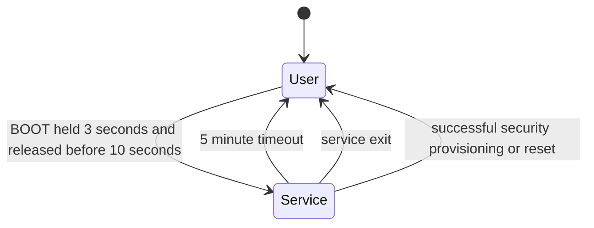

# Manufacturing Service Mode

## Purpose

Service mode provides a bounded local factory and repair surface without weakening normal web authentication, network protocol authorization, relay safety, secure boot, or flash encryption.

It is orthogonal to the application lifecycle:



`User` and `Service` do not replace `Operational`, `Degraded`, or `Fault`. Entering service mode does not stop relay arbitration or create a second path to GPIO.

## Security Boundary

- Entry requires the physical BOOT commissioning gesture detected by `ButtonAdapter`.
- There is no HTTP, WebSocket, KNX, Modbus, Wi-Fi provisioning, or other network entry operation.
- Service operations are exposed only on the local USB serial CLI.
- Sessions expire after five minutes using monotonic time and may be exited manually.
- Startup, factory reset, successful initial web provisioning, and user-configuration erase return to user mode.
- Production identity and manufacturing fields become immutable after factory configuration is locked.
- The service session does not bypass relay lockouts, command queues, lifecycle checks, or existing deployment-profile restrictions.
- Responses never contain Wi-Fi passphrases, web password verifiers, private keys, session tokens, or complete administrator data.

Ordinary authenticated network administrators remain ordinary network users: they cannot enter service mode or invoke its operations.

## Serial Contract

The command family is:

```text
service status
service identity
service diagnostics
service set-manufacturing <YYYY-MM-DD> <batch>
service provision-identity <serial> <uuid> <YYYY-MM-DD> <batch>
service erase-user-configuration
service firmware-recovery
service exit
```

All responses are one machine-readable line beginning with `ok=true` or `ok=false`.

`service status` is safe outside service mode and reports `mode=user`, the transition sequence, zero remaining time, `network_entry=false`, and recovery capability. It does not reveal identity or diagnostics.

`service identity` reports product ID, board model, hardware revision, firmware version, device serial, UUID, manufacturing date, and batch. `service diagnostics` reports bounded health counters, heap information, and active fault count. Both require an active service session.

`service set-manufacturing` validates the ISO date and nonzero batch, then uses the normal staged configuration commit. In a locked production unit it fails with `factory-configuration-locked`.

`service provision-identity` takes product ID, model, and hardware revision from the compiled board descriptor rather than trusting fixture input. Serial, UUID, date, and batch are validated through the complete domain configuration validator before persistence. In a locked production unit it fails closed.

`service erase-user-configuration` is the field-service reset. It follows the same identity-preserving data contract as physical factory reset: product ID, model, hardware revision, serial, UUID, manufacturing date, batch, and factory security identity are retained while user configuration and web users are removed. It requests a controlled restart, and a configuration or security persistence failure is reported explicitly. See [factory-reset.md](factory-reset.md).

## Firmware Recovery

The command is reserved and currently returns `operation-unavailable`; `service status` reports `firmware_recovery=false`. This is intentional. The current partition/release architecture has no separately verified recovery image or recovery boot selector, so restarting into an alleged recovery mode would be unsafe and misleading.

A future implementation must require a signed recovery image, secure-boot verification, rollback-safe partition selection, bounded upload transport, and physical service authorization. It must not permit arbitrary unsigned serial or network flashing from running application firmware.

## Ownership

`ServiceModeService` owns session state, timeout, sequence, and operation policy. `Application` alone converts physical button events into session entry and advances timeout expiry. `CliAdapter` exposes authorized operations but cannot create a session. `ConfigurationService` owns validated identity-preserving user reset persistence.